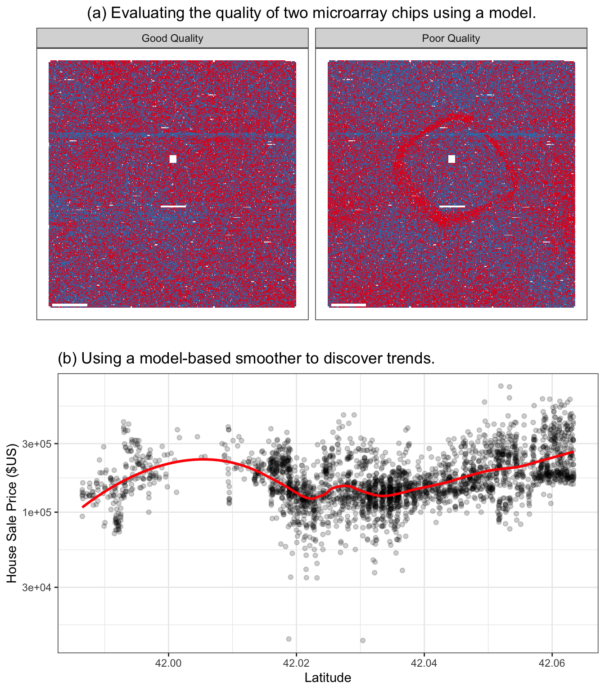
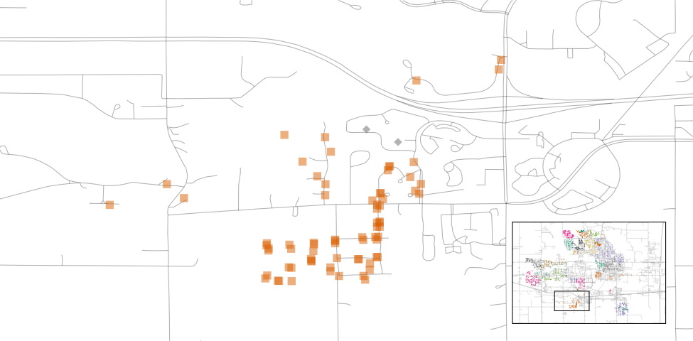
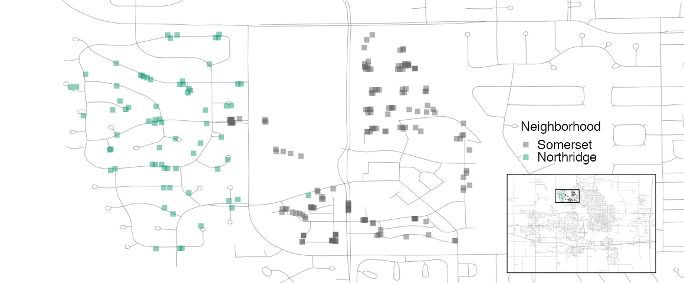
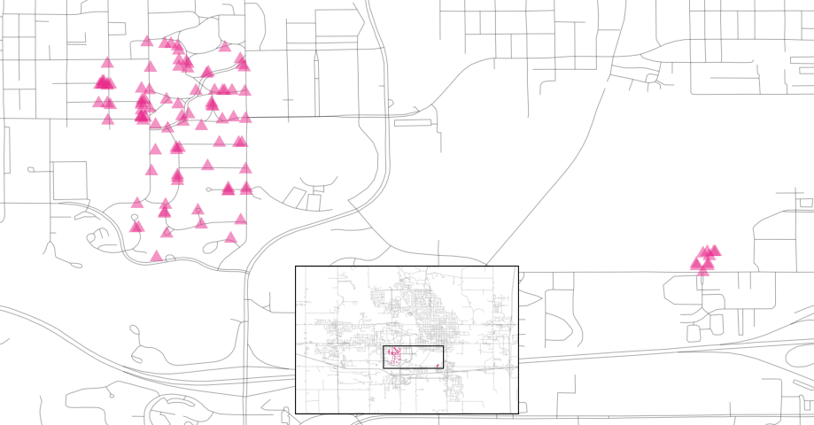
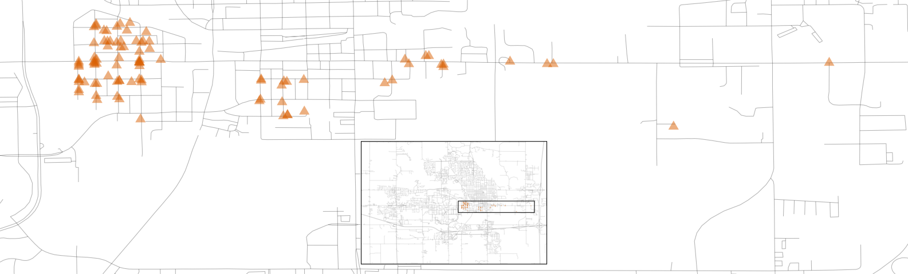
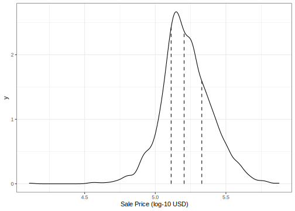

```{r setup, include=FALSE}
knitr::opts_chunk$set(echo = TRUE)
```

## Libraries

```{r}
# install.packages("dplyr")
# install.packages("rsample")
# install.packages("ggplot2")
# install.packages("purrr")
# install.packages("tidyverse")
# install.packages("lubridate")
# install.packages("modeldata")
# install.packages("lattice")
# install.packages("tidymodels")
# install.packages("shiny")
# install.packages("miniUI") 
# install.packages("rstudioapi")
# install.packages("baguette")
# install.packages("lme4")
# install.packages("nlme") # Orthodont


library(dplyr)
library(rsample)
library(ggplot2)
library(purrr)
library(tidyverse)
library(lubridate)
library(modeldata)
library(lattice)
library(tidymodels)
library(shiny)
library(miniUI)
library(rstudioapi)
library(baguette)
library(lme4) 
# library(nlme) # conflicts with lme4
library(survival)
```


## Next Steps

Fix some classification issues with this neural network. 
[https://www.tidymodels.org/learn/](https://www.tidymodels.org/learn/)


## References

Abrams, B. 2003. “The Pit of Success.” 
https://blogs.msdn.microsoft.com/brada/2003/10/02/the-pit-of-success/.

Baggerly, K, and K Coombes. 2009. “Deriving 
Chemosensitivity from Cell Lines: Forensic Bioinformatics 
and Reproducible Research in High-Throughput Biology.” 
The Annals of Applied Statistics 3 (4): 1309–34.

Bolstad, B. 2004. Low-Level Analysis of High-Density 
Oligonucleotide Array Data: Background, Normalization and 
Summarization. University of California, Berkeley.

Breiman, L. 2001b. “Statistical Modeling: The Two 
Cultures.” Statistical Science 16 (3): 199–231.

Carlson, B. 2012. “Putting Oncology Patients at Risk.” 
Biotechnology Healthcare 9 (3): 17–21.

Chambers, J. 1998. Programming with Data: A Guide to the 
S Language. Berlin, Heidelberg: Springer-Verlag.

Chambers, J, and T Hastie, eds. 1992. Statistical Models 
in S. Boca Raton, FL: CRC Press, Inc.

Cleveland, W. 1979. “Robust Locally Weighted Regression 
and Smoothing Scatterplots.” Journal of the American 
Statistical Association 74 (368): 829–36.

De Cock, D. 2011. “Ames, Iowa: Alternative to the Boston 
Housing Data as an End of Semester Regression Project.” 
Journal of Statistics Education 19 (3).

Durrleman, S, and R Simon. 1989. “Flexible Regression 
Models with Cubic Splines.” Statistics in Medicine 8 (5): 
551–61.

Friedman, J, T Hastie, and R Tibshirani. 2010. 
“Regularization Paths for Generalized Linear Models via 
Coordinate Descent.” Journal of Statistical Software 33 
(1): 1.

Gentleman, R, V Carey, W Huber, R Irizarry, and S Dudoit. 
2005. Bioinformatics and Computational Biology Solutions 
Using R and Bioconductor. Berlin, Heidelberg: 
Springer-Verlag.

Johnson, D, P Eckart, N Alsamadisi, H Noble, C Martin, and 
R Spicer. 2018. “Polar Auxin Transport Is Implicated in 
Vessel Differentiation and Spatial Patterning During 
Secondary Growth in Populus.” American Journal of Botany 
105 (2): 186–96.

Kuhn, M, and K Johnson. 2020. Feature Engineering and 
Selection: A Practical Approach for Predictive Models. 
CRC Press.

Mangiafico, S. 2015. “An R Companion for the Handbook of Biological Statistics.” https://rcompanion.org/handbook/.

McDonald, J. 2009. Handbook of Biological Statistics. Sparky House Publishing.

R Core Team. 2014. R: A Language and Environment for 
Statistical Computing. Vienna, Austria: R Foundation for 
Statistical Computing. http://www.R-project.org/.

Shmueli, G. 2010. “To Explain or to Predict?” Statistical 
Science 25 (3): 289–310.

Wickham, H, M Averick, J Bryan, W Chang, L McGowan, R 
François, G Grolemund, et al. 2019. “Welcome to the 
Tidyverse.” Journal of Open Source Software 4 (43).

Wickham, H, M Averick, J Bryan, W Chang, L McGowan, R 
François, G Grolemund, et al. 2019. “Welcome to the 
Tidyverse.” Journal of Open Source Software 4 (43).

Wickham, H, and G Grolemund. 2016. R for Data Science: 
Import, Tidy, Transform, Visualize, and Model Data. 
O’Reilly Media, Inc.


## Hello World

This is my workbook for the book 
["Tidy Modeling with R"](https://www.tmwr.org/).
It uses a new collection of software in the R programming 
language for model building. 

* First and foremost, this book provides an introduction 
to how to use our software to create models. We focus on a
dialect of R called the 
[tidyverse](https://www.tidyverse.org/) that is designed 
to be a better interface for common tasks using R. If 
you’ve never heard of or used the tidyverse, Chapter 2 
provides an introduction. In this book, we demonstrate how 
the tidyverse can be used to produce high quality models. 
The tools used to do this are referred to as the 
_tidymodels packages_.

* Second, we use the tidymodels packages to 
**encourage good methodology and statistical practice**. 
Many models, especially complex predictive or machine 
learning models, can work very well on the data at hand 
but may fail when exposed to new data. Often, this issue 
is due to poor choices made during the development and/or 
selection of the models. Whenever possible, our software, 
documentation, and other materials attempt to prevent 
these and other pitfalls.

## Chapter 1: Software for modeling

Models are mathematical tools that can describe a system 
and capture relationships in the data given to them. 
Models can be used for various purposes, including 
predicting future events, determining if there is a 
difference between several groups, aiding map-based 
visualization, discovering novel patterns in the data that 
could be further investigated, and more. The utility of a 
model hinges on its ability to be reductive. The primary 
influences in the data can be captured mathematically in a 
useful way, such as in a relationship that can be 
expressed as an equation.

Since the beginning of the twenty-first century, 
mathematical models have become ubiquitous in our daily 
lives, in both obvious and subtle ways. A typical day for 
many people might involve checking the weather to see when 
might be a good time to walk the dog, ordering a product 
from a website, typing a text message to a friend and 
having it autocorrected, and checking email. In each of 
these instances, there is a good chance that some type of 
model was involved. In some cases, the contribution of the 
model might be easily perceived (“You might also be 
interested in purchasing product X”) while in other cases, 
the impact could be the absence of something (e.g., spam 
email). Models are used to choose clothing that a customer 
might like, to identify a molecule that should be 
evaluated as a drug candidate, and might even be the 
mechanism that a nefarious company uses to avoid the 
discovery of cars that over-pollute. For better or worse, 
models are here to stay.

|     There are two reasons that models permeate our 
|     lives today: an abundance of software exists to 
|     create models and it has become easier to record 
|     data and make it accessible.

This book focuses largely on software. It is obviously 
critical that software produces the correct relationships 
to represent the data. For the most part, determining 
mathematical correctness is possible, but the reliable 
creation of appropriate models requires more.

First, it is important that it is easy to operate software 
in a proper way. The user interface should not be so 
poorly designed that the user would not know that they 
used it inappropriately. For example, 
Baggerly and Coombes 
(2009) report myriad problems in the data analyses from a 
high profile computational biology publication. One of the 
issues was related to how the users were required to add 
the names of the model inputs. The user interface of the 
software made it easy to offset the column names of the 
data from the actual data columns. This resulted in the 
wrong genes being identified as important for treating 
cancer patients and eventually contributed to the 
termination of several clinical trials 
(Carlson 2012).

If we need high quality models, software must facilitate proper usage. Abrams (2003) describes an interesting principle to guide us:

|   The Pit of Success: in stark contrast to a summit, a 
|   peak, or a journey across a desert to find victory 
|   through many trials and surprises, we want our 
|   customers to simply fall into winning practices by 
|   using our platform and frameworks.

Data analysis and modeling software should espouse this 
idea.

The second important aspect of model building is related 
to scientific methodology. When working with complex 
predictive models, it can be easy to unknowingly commit 
errors related to logical fallacies or inappropriate 
assumptions. Many machine learning models are so adept at 
discovering patterns that they can effortlessly find 
empirical patterns in the data that fail to reproduce 
later. Some of these types of methodological errors are 
insidious in that the issue can go undetected until a 
later time when new data that contain the true result are 
obtained.

|   As our models have become more powerful and complex, |   it has also become easier to commit latent errors.

This same principle also applies to programming. Whenever 
possible, the software should be able to protect users 
from committing mistakes. Software should make it easy 
for users to **do the right thing**.

These two aspects of model development are crucial. Since tools for creating models are easily obtained and models can have such a profound impact, many more people are creating them. In terms of technical expertise and training, their backgrounds will vary. It is important that their tools be robust to the experience of the user. Tools should be powerful enough to create high-performance models, but, on the other hand, should be easy to use in an appropriate way. This book describes a suite of software for modeling which has been designed with these characteristics in mind.

The software is based on the R programming language (R 
Core Team 2014). R has been designed especially for data 
analysis and modeling. It is an implementation of the S 
language (with lexical scoping rules adapted from Scheme 
and Lisp) which was created in the 1970s to
“turn ideas into software, quickly and faithfully” 
(Chambers 1998).

R is open-source and free of charge. It is a powerful 
programming language that can be used for many different 
purposes but specializes in data analysis, modeling, 
visualization, and machine learning. R is easily 
extensible; it has a vast ecosystem of packages, mostly 
user-contributed modules that focus on a specific theme, 
such as modeling, visualization, and so on.

One collection of packages is called the tidyverse 
(Wickham et al. 2019). The tidyverse is an opinionated 
collection of R packages designed for data science. All 
packages share an underlying design philosophy, grammar, 
and data structures. Several of these design philosophies 
are directly informed by the aspects of software 
described in this section. If you’ve never used the 
tidyverse packages, Chapter 2 contains a review of its 
basic concepts. Within the tidyverse, the subset of 
packages specifically focused on modeling are referred to 
as the tidymodels packages. This book is an extended 
software manual for conducting modeling using the 
tidyverse and tidymodels. It shows how to use a set of 
packages, each with its own specific purpose, together to 
create high-quality models.

### Types of Models

Let’s describe a taxonomy for types of models, grouped by 
purpose. While not exhaustive, most models fall into at 
least one of these categories:

#### Descriptive Models

The purpose of a descriptive model is to describe or 
illustrate characteristics of some data. The analysis 
might have no other purpose than to visually emphasize 
some trend or artifact in the data.

For example, large scale measurements of RNA have been 
possible for some time using microarrays. Early laboratory 
methods placed a biological sample on a small microchip. 
Very small locations on the chip can measure a signal 
based on the abundance of a specific RNA sequence. The 
chip would contain thousands (or more) outcomes, each a 
quantification of the RNA related to some biological 
process. However, there could be quality issues on the 
chip that might lead to poor results. A fingerprint 
accidentally left on a portion of the chip might cause 
inaccurate measurements when scanned.

An early method for evaluating such issues were 
probe-level models, or PLM’s (Bolstad 2004). A statistical 
model would be created that accounted for the known 
differences in the data, such as the chip, the RNA 
sequence, the type of sequence, and so on. If there were 
other, unknown factors in the data, these effects would be 
captured in the model residuals. When the residuals were 
plotted by their location on the chip, a good quality chip 
would show no patterns. When a problem did occur, some 
sort of spatial pattern would be discernible. Often the 
type of pattern would suggest the underlying issue (e.g. a 
fingerprint) and a possible solution (wipe the chip off 
and rescan, repeat the sample, etc.). Figure 1.1(a) shows 
an application of this method for two microarrays taken 
from Gentleman et al. (2005). The images show two 
different colors; red is where the signal intensity was 
larger than the model expects while the blue color shows 
lower than expected values. The left-hand panel 
demonstrates a fairly random pattern while the right-hand 
panel exhibits an undesirable artifact in the middle of 
the chip.



Another example of a descriptive model is the locally 
estimated scatterplot smoothing model, more commonly known 
as LOESS (Cleveland 1979). Here, a smooth and flexible 
regression model is fit to a data set, usually with a 
single independent variable, and the fitted regression 
line is used to elucidate some trend in the data. These 
types of smoothers are used to discover potential ways to 
represent a variable in a model. This is demonstrated in 
Figure 1.1(b) where a nonlinear trend is illuminated by 
the flexible smoother. From this plot, it is clear that 
there is a highly nonlinear relationship between the sale 
price of a house and its latitude.

#### Inferential Models

The goal of an inferential model is to produce a decision 
for a research question or to test a specific hypothesis, 
in much the way that statistical tests are used1. The goal 
is to make some statement of truth regarding a predefined 
conjecture or idea. In many (but not all) cases, a 
qualitative statement is produced (e.g., a difference was 
“statistically significant”).

For example, the goal of a clinical trial might be to 
provide confirmation that a new therapy does a better job 
in prolonging life than an alternative, like an existing 
therapy or no treatment at all. If the clinical endpoint 
was related to survival of a patient, the null hypothesis 
might be that the two therapeutic groups have equal median 
survival times, with the alternative hypothesis being that 
the new therapy has higher median survival. If this trial 
were evaluated using traditional null hypothesis 
significance testing via modeling, the significance 
testing would produce a p-value using some pre-defined 
methodology based on a set of assumptions for the data. 
Small values for the p-value in the model results would 
indicate that there is evidence that the new therapy helps 
patients live longer. Large values for the p-value in the 
model results would conclude that there is a failure to 
show such a difference; this lack of evidence could be due 
to a number of reasons, including the therapy not working.

What are the important aspects of this type of analysis? 
Inferential modeling techniques typically produce some 
type of probabilistic output, such as a p-value, 
confidence interval, or posterior probability. Generally, 
to compute such a quantity, formal probabilistic 
assumptions must be made about the data and the underlying 
processes that generated the data. The quality of the 
statistical modeling results are highly dependent on these 
pre-defined assumptions as well as how much the observed 
data appear to agree with them. The most critical factors 
here are theoretical in nature: “If my data were 
independent and follow distribution X, then test statistic 
Y can be used to produce a p-value. Otherwise, the 
resulting p-value might be inaccurate.”

One aspect of inferential analyses is that there tends to 
be a delayed feedback loop in understanding how well the 
data matches the model assumptions. In our clinical trial 
example, if statistical (and clinical) significance 
indicate that the new therapy should be available for 
patients to use, it still may be years before it is used 
in the field and enough data are generated for an 
independent assessment of whether the original statistical 
analysis led to the appropriate decision.

#### Predictive Models

Sometimes data are modeled to produce the most accurate 
prediction possible for new data. Here, the primary goal 
is that the predicted values have the highest possible 
fidelity to the true value of the new data.

A simple example would be for a book buyer to predict how 
many copies of a particular book should be shipped to 
their store for the next month. An over-prediction wastes 
space and money due to excess books. If the prediction is 
smaller than it should be, there is opportunity loss and 
less profit.

For this type of model, the problem type is one of 
estimation rather than inference. For example, the buyer 
is usually not concerned with a question such as “Will I 
sell more than 100 copies of book X next month?” but 
rather “How many copies of book X will customers purchase 
next month?” Also, depending on the context, there may not 
be any interest in why the predicted value is X. In other 
words, there is more interest in the value itself than 
evaluating a formal hypothesis related to the data. The 
prediction can also include measures of uncertainty. In 
the case of the book buyer, providing a forecasting error 
may be helpful in deciding how many to purchase. It can 
also serve as a metric to gauge how well the prediction 
method worked.

What are the most important factors affecting predictive 
models? There are many different ways that a predictive 
model can be created, so the important factors depend on 
how the model was developed.

A **mechanistic model** could be derived using first 
principles to produce a model equation that is dependent 
on assumptions. For example, when predicting the amount of 
a drug that is in a person’s body at a certain time, some 
formal assumptions are made on how the drug is 
administered, absorbed, metabolized, and eliminated. Based 
on this, a set of differential equations can be used to 
derive a specific model equation. Data are used to 
estimate the unknown parameters of this equation so that 
predictions can be generated. Like inferential models, 
mechanistic predictive models greatly depend on the 
assumptions that define their model equations. However, 
unlike inferential models, it is easy to make data-driven 
statements about how well the model performs based on how 
well it predicts the existing data. Here the feedback loop 
for the modeling practitioner is much faster than it would 
be for a hypothesis test.

**Empirically driven models** are created with more vague 
assumptions. These models tend to fall into the machine 
learning category. A good example is the K-nearest 
neighbor (KNN) model. Given a set of reference data, a new 
sample is predicted by using the values of the K most 
similar data in the reference set. For example, if a book 
buyer needs a prediction for a new book, historical data 
from existing books may be available. A 5-nearest neighbor 
model would estimate the amount of the new books to 
purchase based on the sales numbers of the five books that 
are most similar to the new one (for some definition of 
“similar”). This model is only defined by the structure of 
the prediction (the average of five similar books). No 
theoretical or probabilistic assumptions are made about 
the sales numbers or the variables that are used to define 
similarity. In fact, the primary method of evaluating the 
appropriateness of the model is to assess its accuracy 
using existing data. If the structure of this type of 
model was a good choice, the predictions would be close to 
the actual values.

Broader discussions of these distinctions can be found in 
Breiman (2001b) and Shmueli (2010).

An ordinary linear regression model might fall into any of 
these three classes of model, depending on how it is used:

-    A descriptive smoother, similar to LOESS, called 
restricted smoothing splines (Durrleman and Simon 1989) 
can be used to describe trends in data using ordinary 
linear regression with specialized terms.

-    An analysis of variance (ANOVA) model is a popular 
method for producing the p-values used for inference. 
ANOVA models are a special case of linear regression.

-    If a simple linear regression model produces highly 
accurate predictions, it can be used as a predictive 
model.

There are many examples of predictive models that cannot 
(or at least should not) be used for inference. Even if 
probabilistic assumptions were made for the data, the 
nature of the KNN model makes the math required for 
inference intractable.

There is an additional connection between the types of 
models. While the primary purpose of descriptive and 
inferential models might not be related to prediction, the 
predictive capacity of the model should not be ignored. 
For example, logistic regression is a popular model for 
data where the outcome is qualitative with two possible 
values. It can model how variables are related to the 
probability of the outcomes. When used in an inferential 
manner, there is usually an abundance of attention paid to 
the statistical qualities of the model. For example, 
analysts tend to strongly focus on the selection of which 
independent variables are contained in the model. Many 
iterations of model building are usually used to determine 
a minimal subset of independent variables that have a 
“statistically significant” relationship to the outcome 
variable. This is usually achieved when all of the 
p-values for the independent variables are below some 
value (e.g. 0.05). From here, the analyst typically 
focuses on making qualitative statements about the 
relative influence that the variables have on the outcome 
(e.g., “There is a statistically significant relationship 
between age and the odds of heart disease.”).

This can be dangerous when statistical significance is 
used as the only measure of model quality. It is possible 
that this statistically optimized model has poor model 
accuracy, or performs poorly on some other measure of 
predictive capacity. While the model might not be used for 
prediction, how much should inferences be trusted from a 
model that has significant p-values but dismal accuracy? 
Predictive performance tends to be related to how close 
the model’s fitted values are to the observed data.

|   If a model has limited fidelity to the data, the 
|   inferences generated by the model should be highly 
|   suspect. In other words, statistical significance may 
|   not be sufficient proof that a model is appropriate.

This may seem intuitively obvious, but is often ignored in 
real-world data analysis.

### Some Terminology

Before proceeding, we outline here some additional 
terminology related to modeling and data. These 
descriptions are intended to be helpful as you read this 
book but not exhaustive.

First, many models can be categorized as being 
_supervised_ or _unsupervised_. Unsupervised models are 
those that learn patterns, clusters, or other 
characteristics of the data but lack an outcome, i.e., a 
dependent variable. Principal component analysis (PCA), 
clustering, and autoencoders are examples of unsupervised 
models; they are used to understand relationships between 
variables or sets of variables without an explicit 
relationship between predictors and an outcome. Supervised 
models are those that have an outcome variable. Linear 
regression, neural networks, and numerous other 
methodologies fall into this category.

Within supervised models, there are two main 
sub-categories:

-    **Regression** predicts a numeric outcome.

-    **Classification** predicts an outcome that is an 
ordered or unordered set of qualitative values.

These are imperfect definitions and do not account for all 
possible types of models. In Chapter 6, we refer to this 
characteristic of supervised techniques as the 
_model mode_.

Different variables can have different _roles_, especially 
in a supervised modeling analysis. Outcomes (otherwise 
known as the labels, endpoints, or dependent variables) 
are the value being predicted in supervised models. The 
independent variables, which are the substrate for making 
predictions of the outcome, are also referred to as 
predictors, features, or covariates (depending on the 
context). The terms _outcomes_ and _predictors_ are used 
most frequently in this book.

In terms of the data or variables themselves, whether used 
for supervised or unsupervised models, as predictors or 
outcomes, the two main categories are quantitative and 
qualitative. Examples of the former are real numbers like 
`3.14159` and integers like `42`. Qualitative values, also 
known as nominal data, are those that represent some sort 
of discrete state that cannot be naturally placed on a 
numeric scale, like “red”, “green”, and “blue”.

### How does modeling fit into the data analysis process?

In what circumstances are models created? Are there steps 
that precede such an undertaking? Is it the first step in 
data analysis?

First, there is the chronically underestimated process of 
**cleaning the data**. No matter the circumstances, you 
should investigate the data to make sure that they are 
applicable to your project goals, accurate, and 
appropriate. These steps can easily take more time than 
the rest of the data analysis process (depending on the 
circumstances).

Data cleaning can also overlap with the second phase of 
**understanding the data**, often referred to as 
exploratory data analysis (EDA). EDA brings to light how 
the different variables are related to one another, their 
distributions, typical ranges, and other attributes. A 
good question to ask at this phase is, “How did I come by 
_these_ data?” This question can help you understand how 
the data at hand have been sampled or filtered and if 
these operations were appropriate. For example, when 
merging database tables, a join may go awry that could 
accidentally eliminate one or more sub-populations. 
Another good idea is to ask if the data are _relevant_. 
For example, to predict whether patients have Alzheimer’s 
disease or not, it would be unwise to have a data set 
containing subjects with the disease and a random sample 
of healthy adults from the general population. Given the 
progressive nature of the disease, the model may simply 
predict who are the _oldest patients_.

Finally, before starting a data analysis process, there 
should be clear expectations of the goal of the model and 
how performance (and success) will be judged. At least one 
_performance metric_ should be identified with realistic 
goals of what can be achieved. Common statistical metrics, 
discussed in more detail in Chapter 9, are classification 
accuracy, true and false positive rates, root mean squared 
error, and so on. The relative benefits and drawbacks of 
these metrics should be weighed. It is also important that 
the metric be germane; alignment with the broader data 
analysis goals is critical.


The process of investigating the data may not be simple. 
Wickham and Grolemund (2016) contains an excellent 
illustration of the general data analysis process, 
reproduced with Figure 1.2. Data ingestion and 
cleaning/tidying are shown as the initial steps. When the 
analytical steps for understanding commence, they are a 
heuristic process; we cannot pre-determine how long they 
may take. The cycle of analysis, modeling, and 
visualization often requires multiple iterations.


This iterative process is especially true for modeling. 
Figure 1.3 is meant to emulate the typical path to 
determining an appropriate model. The general phases are:

-    **Exploratory data analysis (EDA)**: Initially there 
is a back and forth between numerical analysis and 
visualization of the data (represented in Figure 1.2) 
where different discoveries lead to more questions and 
data analysis “side-quests” to gain more understanding.

-    **Feature engineering**: The understanding gained 
from EDA results in the creation of specific model terms 
that make it easier to accurately model the observed data. 
This can include complex methodologies (e.g., PCA) or 
simpler features (using the ratio of two predictors). 
Chapter 8 focuses entirely on this important step.

-    **Model tuning and selection (circles with blue and yellow segments)**: 
A variety of models are generated and their performance is 
compared. Some models require parameter tuning where some 
structural parameters are required to be specified or 
optimized. The colored segments within the circles signify 
the repeated data splitting used during resampling (see 
Chapter 10).

-    **Model evaluation**: During this phase of model 
development, we assess the model’s performance metrics, 
examine residual plots, and conduct other EDA-like 
analyses to understand how well the models work. In some 
cases, formal between-model comparisons (Chapter 11) help 
you to understand whether any differences in models are 
within the experimental noise.

After an initial sequence of these tasks, more 
understanding is gained regarding which types of models 
are superior as well as which sub-populations of the data 
are not being effectively estimated. This leads to 
additional EDA and feature engineering, another round of 
modeling, and so on. Once the data analysis goals are 
achieved, the last steps are typically to finalize, 
document, and communicate the model. For predictive 
models, it is common at the end to validate the model on 
an additional set of data reserved for this specific 
purpose.

As an example, Kuhn and Johnson (2020) use data to model 
the daily ridership of Chicago’s public train system using 
predictors such as the date, the previous ridership 
results, the weather, and other factors. An approximation 
of these authors’ “inner monologue” when analyzing these 
data is, in order:

Thoughts  | Activity
-------------------------------------------- | ---------
The daily ridership values between stations are extremely correlated.  | EDA
Weekday and weekend ridership look very different.  | EDA
One day in the summer of 2010 has an abnormally large number of riders.  | EDA
Which stations had the lowest daily ridership values?  | EDA
Dates should at least be encoded as day-of-the-week, and year.  | Feature Engineering
Maybe PCA could be used on the correlated predictors to make it easier for the models to use them.  | Feature Engineering
Hourly weather records should probably be summarized into daily measurements.  | Feature Engineering
Let’s start with simple linear regression, K-nearest neighbors, and a boosted decision tree.  | Model Fitting
How many neighbors should be used?  | Model Tuning
Should we run a lot of boosting iterations or just a few?  | Model Tuning
How many neighbors seemed to be optimal for these data?  | Model Tuning
Which models have the lowest root mean squared errors?  | Model Evaluation
Which days were poorly predicted?  | EDA
Variable importance scores indicate that the weather information is not predictive. We’ll drop them from the next set of models.  | Model Evaluation
It seems like we should focus on a lot of boosting iterations for that model.  | Model Evaluation
We need to encode holiday features to improve predictions on (and around) those dates.  | Feature Engineering
Let’s drop K-NN from the model list.  | Model Evaluation 

###  Chapter summary

This chapter focused on how models describe relationships 
in data, and different types of models such as descriptive 
models, inferential models, and predictive models. The 
predictive capacity of a model can be used to evaluate it, 
even when its main goal is not prediction. Modeling itself 
sits within the broader data analysis process, and 
exploratory data analysis is a key part of building 
high-quality models.

For all kinds of modeling, software for building models 
must support good scientific methodology and ease of use 
for practitioners from diverse backgrounds. The software 
we develop approaches this with the ideas and syntax of 
the tidyverse, which we introduce (or review) in Chapter 
2. Chapter 3 is a quick tour of conventional base R 
modeling functions and summarize the unmet needs in that 
area.

After that, this book is separated into parts, starting 
with the basics of modeling with tidy data principles. The 
first part introduces an example data set on house prices 
and demonstrates how to use the fundamental tidymodels 
packages: recipes, parsnip, workflows, yardstick, and 
others.

The second part of the book moves forward with more 
details on the process of creating a good model. This 
includes creating good estimates of performance as well as 
tuning model parameters.

## A tidyverse primer

The tidyverse is a collection of R packages for data 
analysis that are developed with common ideas and norms. 
From Wickham et al. (2019):

|   “At a high level, the tidyverse is a language for 
|   solving data science challenges with R code. Its 
|   primary goal is to facilitate a conversation between 
|   a human and a computer about data. Less abstractly, 
|   the tidyverse is a collection of R packages that 
|   share a high-level design philosophy and low-level 
|   grammar and data structures, so that learning one 
|   package makes it easier to learn the next.”

### Principles

The full set of strategies and tactics for writing R code 
in the tidyverse style can be found at the website 
[https://design.tidyverse.org](https://design.tidyverse.org). 
Here we can briefly describe several of the design 
principles, their motivation, and how we think about 
modeling as an application of these principles.

#### Design for Humans

The tidyverse focuses on designing R packages and 
functions that can be easily understood and used by a 
broad range of people. Both historically and today, a 
substantial percentage of R users are not people who 
create software or tools but instead people who create 
analyses or models. As such, R users do not typically have 
(or need) computer science backgrounds, and many are not 
interested in writing their own R packages.

For this reason, it is critical that R code be easy to 
work with to accomplish your goals. Documentation, 
training, accessibility, and other factors play an 
important part in achieving this. However, if the syntax 
itself is difficult for people to easily comprehend, 
documentation is a poor solution. The software itself must 
be intuitive.

To contrast the tidyverse approach with more traditional R 
semantics, consider sorting a data frame. Using only the 
core language, we can sort a data frame using one or more 
columns by reordering the rows via R’s subscripting rules 
in conjunction with `order()`; you cannot successfully use 
a function you might be tempted to try in such a situation 
because of its name, `sort()`. To sort the `mtcars` data 
by two of its columns, the call might look like:

```{r}
mtcars[order(mtcars$gear, mtcars$mpg), ]
```

While very computationally efficient, it would be 
difficult to argue that this is an intuitive user 
interface. In dplyr by contrast, the tidyverse function 
`arrange()` takes a set of variable names as input 
arguments directly:

```{r}
arrange(.data = mtcars, gear, mpg)
```


|   The variable names used here are “unquoted”; many 
|   traditional R functions require a character string 
|   to specify variables, but tidyverse functions take 
|   unquoted names or selector functions. The selectors 
|   allow for one or more readable rules that are 
|   applied to the column names. For example, 
|   ends_with("t") would select the drat and wt columns 
|   of the mtcars data frame.

Additionally, naming is crucial. If you were new to R and 
were writing data analysis or modeling code involving 
linear algebra, you might be stymied when searching for a 
function that computes the matrix inverse. Using 
`apropos("inv")` yields no candidates. It turns out that 
the base R function for this task is `solve()`, for 
solving systems of linear equations. For a matrix `X`, you 
would use `solve(X)` to invert `X` (with no vector for the 
right-hand side of the equation). This is only documented 
in the description of one of the arguments in the help 
file. In essence, you need to know the name of the 
solution to be able to find the solution.

The tidyverse approach is to use function names that are 
descriptive and explicit over those that are short and 
implicit. There is a focus on verbs (e.g. `fit`, 
`arrange`, etc.) for general methods. Verb-noun pairs are 
particularly effective; consider `invert_matrix()` as a 
hypothetical function name. In the context of modeling, it 
is also important to avoid highly technical jargon in 
names such as Greek letters or obscure terms. Names should 
be as self-documenting as possible.

When there are similar functions in a package, function 
names are designed to be optimized for tab-completion. For 
example, the `glue` package has a collection of functions 
starting with a common prefix (`glue_`) that enables users 
to quickly find the function they are looking for.

#### Reuse existing data structures

Whenever possible, functions should avoid returning a 
novel data structure. If the results are conducive to an 
existing data structure, it should be used. This reduces 
the cognitive load when using software; no additional 
syntax or methods are required.

One data structure that is used as much as possible in 
tidyverse and tidymodels packages is the data frame. Data 
frames can represent different types of data in each 
column, and multiple values in each row. Tibbles, a type 
of data frame described below, are preferred since they 
have additional properties that are helpful for data 
analysis.

As an example, the `rsample` package can be used to create 
_resamples_ of a data set, such as cross-validation or the 
bootstrap (described in Chapter 10). The resampling 
functions return a tibble with a column called `splits` of 
objects that define the resampled data sets. Three 
bootstrap samples of a data set might look like:

```{r}
boot_samp <- rsample::bootstraps(mtcars, times = 3)
boot_samp
class(boot_samp)
```

With this approach, vector-based functions can be used 
with these columns, such as `vapply()` or `purrr::map()2`. 
This `boot_samp` object has multiple classes but inherits 
methods for data frames (`"data.frame"`) and tibbles 
(`"tbl_df"`). Additionally, new columns can be added to 
the results without affecting the class of the data. This 
is much easier and more versatile for users to work with 
than a completely new object type that does not make its 
data structure obvious.

One downside to relying on common data structures is the 
potential loss of computational performance. In some 
situations, data can be encoded in specialized formats 
that are more efficient representations of the data. For 
example:

-    In computational chemistry, the structure-data file 
format (SDF) is a tool to take chemical structures and 
encode them in a format that is computationally efficient 
to work with.

-    Data that have a large number of values that are the 
same (such as zeros for binary data) can be stored in a 
_sparse matrix format_. This format can reduce the size of 
the data as well as enable more efficient computational 
techniques.

These formats are advantageous when the problem is well 
scoped and the potential data processing methods are both 
well defined and suited to such a format3. However, once 
such constraints are violated, specialized data formats 
are less useful. For example, if we perform a 
transformation of the data that converts the data into 
fractional numbers, the output is no longer sparse; the 
sparse matrix representation is helpful for one specific 
algorithmic step in modeling but this is often not true 
before or after that specific step.

|   A specialized data structure is not flexible enough 
|   for an entire modeling workflow in the way that a 
|   common data structure is.

One important feature in the tibble produced by `rsample` 
is that the `splits` column is a list. In this instance, 
each element of the list has the same type of object: an 
`rsplit` object that contains the information about which 
rows of `mtcars` belong in the bootstrap sample. List 
columns can be very useful in data analysis and, as will 
be seen throughout this book, are important to tidymodels.

#### Design for the pipe and functional programming

The `magrittr` pipe operator (`%>%`) is a tool for 
chaining together a sequence of R functions. To 
demonstrate, consider the following commands which sort a 
data frame and then retain the first 10 rows:

```{r}
small_mtcars <- arrange(mtcars, gear)
small_mtcars <- slice(small_mtcars, 1:10)

# or more compactly: 
small_mtcars <- slice(arrange(mtcars, gear), 1:10)
```

The pipe operator substitutes the value of the left-hand 
side of the operator as the first argument to the 
right-hand side, so we can implement the same result as 
above with:

```{r}
small_mtcars <- 
  mtcars %>% 
  arrange(gear) %>% 
  slice(1:10)
```

The piped version of this sequence is more readable; this 
readability increases as more operations are added to a 
sequence. This approach to programming works in this 
example because all of the functions we used return the 
same data structure (a data frame) that is then the first 
argument to the next function. This is by design. When 
possible, create functions that can be incorporated into a 
pipeline of operations.

If you have used `ggplot2`, this is not unlike the 
layering of plot components into a `ggplot` object with 
the `+` operator. To make a scatter plot with a regression 
line, the initial `ggplot()` call is augmented with two 
additional operations:

```{r}
ggplot(mtcars, aes(x = wt, y = mpg)) +
  geom_point() + 
  geom_smooth(method = lm)
```

While similar to the `dplyr` pipeline, note that the first 
argument to this pipeline is a data set (`mtcars`) and 
that each function call returns a `ggplot` object. Not all 
pipelines need to keep the returned values (plot objects) 
the same as the initial value (a data frame). Using the 
pipe operator with `dplyr` operations has acclimated many 
R users to expect to return a data frame when pipelines 
are used; as shown with `ggplot2`, this does not need to 
be the case. Pipelines are incredibly useful in modeling 
workflows but modeling pipelines can return, instead of a 
data frame, objects such as model components.

R has excellent tools for creating, changing, and 
operating on functions, making it a great language for 
_functional programming_. This approach can replace 
iterative loops in many situations, such as when a 
function returns a value without other side effects.

Let’s look at an example. Suppose you are interested in 
the logarithm of the ratio of the fuel efficiency to the 
car weight. To those new to R and/or coming from other 
programming languages, a loop might seem like a good 
option:

```{r}
n <- nrow(mtcars)
ratios <- rep(NA_real_, n)
for (car in 1:n) {
  ratios[car] <- log(mtcars$mpg[car]/mtcars$wt[car])
}
head(ratios)
```

Those with more experience in R may know that there is a 
much simpler and faster _vectorized version_ that can be 
computed by:

```{r}
ratios <- log(mtcars$mpg/mtcars$wt)
```

However, in many real-world cases, the element-wise 
operation of interest is too complex for a vectorized 
solution. In such a case, a good approach is to write a 
_function_ to do the computations. When we design for 
functional programming, it is important that the output 
only depends on the inputs and that the function has no 
side effects. Violations of these ideas in the following 
function are shown with comments:

```{r}
compute_log_ratio <- function(mpg, wt) {
  log_base <- getOption("log_base", default = exp(1)) # gets external data
  results <- log(mpg/wt, base = log_base)
  print(mean(results))                                # prints to the console
  done <<- TRUE                                       # sets external data
  results
}
```

A better version would be:

```{r}
compute_log_ratio <- function(mpg, wt, log_base = exp(1)) {
  log(mpg/wt, base = log_base)
}
```

The `purrr` package contains tools for functional 
programming. Let’s focus on the `map()` family of 
functions, which operates on vectors and always returns 
the same type of output. The most basic function, `map()`, 
always returns a list and uses the basic syntax of 
`map(vector, function)`. For example, to take the 
square-root of our data, we could:

```{r}
map(head(mtcars$mpg, 3), sqrt)
```

There are specialized variants of `map()` that return 
values when we know or expect that the function will 
generate one of the basic vector types. For example, since 
the square-root returns a double-precision number:

```{r}
map_dbl(head(mtcars$mpg, 3), sqrt)
```

There are also mapping functions that operate across 
multiple vectors:

```{r}
ratios <- map2_dbl(mtcars$mpg, mtcars$wt, 
                   compute_log_ratio)
head(ratios)
```

The `map()` functions also allow for temporary, anonymous 
functions defined using the tilde character. The argument 
values are `.x` and `.y` for `map2()`:

```{r}
map2_dbl(mtcars$mpg, mtcars$wt, ~ log(.x/.y)) %>% 
  head()
```

These examples have been trivial but, in later sections, 
are applied to more complex problems.

|   For functional programming in tidy modeling, 
|   functions should be defined so that functions 
|   like `map()` can be used for iterative 
|   computations.

### Examples of tidyverse syntax

Before diving into examples, let’s discuss how the 
tidyverse relies on a type of data frame called a 
“tibble”. Tibbles have slightly different rules than basic 
data frames in R. For example, tibbles naturally work with 
column names that are not syntactically valid variable 
names:

```{r}
# Wants valid names:
data.frame(`variable 1` = 1:2, two = 3:4)
# But can be coerced to use them with an extra option:
df <- data.frame(`variable 1` = 1:2, two = 3:4, 
                 check.names = FALSE)
df
# But tibbles just work:
tbbl <- tibble(`variable 1` = 1:2, two = 3:4)
tbbl
```

Standard data frames enable _partial matching_ of 
arguments so that code using only a portion of the column 
names still work. Tibbles prevent this from happening 
since it can lead to accidental errors.

```{r}
df$tw
tbbl$tw
```

Tibbles also prevent one of the most common R errors: 
dropping dimensions. If a standard data frame subsets the 
columns down to a single column, the object is converted 
to a vector. Tibbles _never_ do this:

```{r}
df[, "two"]
tbbl[, "two"]
```

There are various other advantages to using tibbles 
instead of data frames, such as better printing and more. 
Chapter 10 of Wickham and Grolemund (2016) has more 
details on tibbles.

To demonstrate some syntax, let’s use tidyverse functions 
to read in data that could be used in modeling. The data 
set comes from the city of Chicago’s data portal and 
contains daily ridership data for the city’s elevated 
train stations. The data set has columns for:

-    the station identifier (numeric),
-    the station name (character),
-    the date (character in `mm/dd/yyyy` format),
-    the day of the week (character), and
-    the number of riders (numeric).

Our tidyverse pipeline will conduct the following tasks, 
in order:

1.    We will use the tidyverse package `readr` to read the data from the source website and convert them into a tibble. To do this, the `read_csv()` function can determine the type of data by reading an initial number of rows. Alternatively, if the column names and types are already known, a column specification can be created in R and passed to `read_csv()`.

2.    We filter the data to eliminate a few columns that are not needed (such as the station ID) and change the column `stationname` to `station`. The function `select()` is used for this. When filtering, use either the names of the column names or a `dplyr` selector function. When selecting names, a new variable name can be declared using the argument format `new_name` = `old_name`.

3.    The date field is converted to the R date format using the `mdy()` function from the `lubridate` package. We also convert the ridership numbers to thousands. Both of these computations are executed using the `dplyr::mutate()` function.

4.    There are a small number of days that have replicate ridership numbers at certain stations. To mitigate this issue, we use the maximum number of rides for each station and day combination. We group the ridership data by station and day, and then _summarize_ within each of the 1999 unique combinations with the maximum statistic.

The tidyverse code for these steps is:

```{r cache=TRUE}
library(tidyverse)
library(lubridate)

url <- "http://bit.ly/raw-train-data-csv"

all_stations <- 
  # Step 1: Read in the data.
  read_csv(url) %>% 
  # Step 2: filter columns and rename stationname
  dplyr::select(station = stationname, date, rides) %>% 
  # Step 3: Convert the character date field to a date encoding.
  # Also, put the data in units of 1K rides
  mutate(date = mdy(date), rides = rides / 1000) %>% 
  # Step 4: Summarize the multiple records using the maximum.
  group_by(date, station) %>% 
  summarize(rides = max(rides), .groups = "drop")
```

This pipeline of operations illustrates why the tidyverse 
is popular. A series of data manipulations is used that 
have simple and easy to understand user interfaces; the 
series is bundled together in a streamlined and readable 
way. The focus is on how the user interacts with the 
software. This approach enables more people to learn R and 
achieve their analysis goals, and adopting these same 
principles for modeling in R has the same benefits.

### Chapter Summary

This chapter introduced the tidyverse, with a focus on 
applications for modeling. We described differences in 
conventions between the tidyverse and base R, and 
introduced two important components of the tidyverse 
system, tibbles and the pipe operator `%>%`. Data cleaning 
and processing can feel mundane at times, but these tasks 
are important for modeling in the real world; we 
illustrated how to use tibbles, the pipe, and tidyverse 
functions in an example data import and processing 
exercise.

## A Review of R Modeling Fundamentals

This book is about creating models with R. Before 
describing how to apply tidy data principles, let’s review 
how models are created, trained, and used in the core R 
language (often called “base R”). This chapter is a brief 
illustration of core language conventions. It is not 
exhaustive but provides readers (especially those new to 
R) the basic, most commonly used motifs.

The S language, on which R is based, has had a rich data 
analysis environment since the publication of Chambers and 
Hastie (1992) (commonly known as The White Book). This 
version of S introduced standard infrastructure components 
familiar to R users today, such as symbolic model 
formulae, model matrices, and data frames, as well as 
standard object-oriented programming methods for data 
analysis. These user-interfaces have not substantively 
changed since then.

### An Example

To demonstrate these fundamentals, let’s use experimental data from McDonald (2009), by way of Mangiafico (2015), on the relationship between the ambient temperature and the rate of cricket chirps per minute. Data were collected for two species: _O. exclamationis_ and _O. niveus_. The data are contained in a data frame called `crickets` with a total of 31 data points. These data are shown here in a `ggplot2` graph.

```{r}
library(tidyverse)
# Error: package cricketr; actually modeldata

data(crickets, package = "modeldata")
names(crickets)

# Plot the temperature on the x-axis, the chirp rate on 
# the y-axis. The plot elements will be colored 
# differently for each species:
ggplot(crickets, aes(x = temp, y = rate, col = species)) + 
  # Plot points for each data point and color by species
  geom_point() + 
  # Show a simple linear model fit created separately for 
  # each species:
  geom_smooth(method = lm, se = FALSE) + 
  labs(x = "Temperature (C)", 
       y = "Chirp Rate (per minute)")
```

The data exhibit fairly linear trends for each species. 
For a given temperature, _O. exclamationis_ appears to 
chirp more per minute than the other species. For an 
inferential model, the researchers might have specified 
the following null hypotheses prior to seeing the data:

-    Temperature has no effect on the chirp rate.

-    There are no differences between the species’ chirp 
rate.

There may be some scientific or practical value in 
predicting the chirp rate but in this example we will 
focus on inference.

To fit an ordinary linear model in R, the `lm()` function 
is commonly used. The important arguments to this function 
are a model formula and a data frame that contains the 
data. The formula is `symbolic`. For example, the simple 
formula:

```{r}
rate ~ temp
```

specifies that the chirp rate is the outcome (since it is 
on the left-hand side of the tilde `~`) and that the 
temperature value is the predictor. Suppose the data 
contained the time of day in which the measurements were 
obtained in a column called `time`. The formula:

```{r}
rate ~ temp + time
```

would not add the time and temperature values together. 
This formula would symbolically represent that temperature 
and time should be added as separate main effects to the 
model. A main effect is a model term that contains a 
single predictor variable.

There are no time measurements in these data but the 
species can be added to the model in the same way:

```{r}
rate ~ temp + species
```

Species is not a quantitative variable; in the data frame, 
it is represented as a factor column with levels 
`"O. exclamationis"` and `"O. niveus"`. The vast majority 
of model functions cannot operate on non-numeric data. For 
species, the model needs to _encode_ the species data in a 
numeric format. The most common approach is to use 
indicator variables (also known as “dummy variables”) in 
place of the original qualitative values. In this 
instance, since species has two possible values, the model 
formula will automatically encode this column as numeric 
by adding a new column that has a value of zero when the 
species is `"O. exclamationis"` and a value of one when 
the data correspond to `"O. niveus"`. The underlying 
formula machinery automatically converts these values for 
the data set used to create the model, as well as for any 
new data points (for example, when the model is used for 
prediction).

|   Suppose there were five species instead of two. The 
|   model formula would automatically add four additional 
|   binary columns that are binary indicators for four of 
|   the species. The reference level of the factor (i.e., 
|   the first level) is always left out of the predictor 
|   set. The idea is that, if you know the values of the 
|   four indicator variables, the value of the species can 
|   be determined. We discuss binary indicator variables 
|   in more detail in Section 8.4.1.

The model formula shown above creates a model with 
different y-intercepts for each species; the slopes of the 
regression lines could be different for each species as 
well. To accommodate this structure, an interaction term 
can be added to the model. This can be specified in a few 
different ways, and the most basic uses the colon:

```{r}
rate ~ temp + species + temp:species

# A shortcut can be used to expand all interactions containing
# interactions with two variables:
rate ~ (temp + species)^2

# Another shortcut to expand factors to include all possible
# interactions (equivalent for this example):
rate ~ temp * species
```

In addition to the convenience of automatically creating 
indicator variables, the formula offers a few other 
niceties:

-    _In-line_ functions can be used in the formula. For 
example, to use the natural log of the temperature, we can 
create the formula `rate ~ log(temp)`. Since the formula 
is symbolic by default, literal math can also be applied 
to the predictors using the identity function `I()`. To 
use Fahrenheit units, the formula could be 
`rate ~ I( (temp * 9/5) + 32 )` to convert from Celsius.

-    R has many functions that are useful inside of 
formulas. For example, `poly(x, 3)` creates linear, 
quadratic, and cubic terms for x to the model as main 
effects. The `splines` package also has several functions 
to create nonlinear spline terms in the formula.

-    For data sets where there are many predictors, the 
period shortcut is available. The period represents main 
effects for all of the columns that are not on the 
left-hand side of the tilde. Using `~ (.)^3` would create 
main effects as well as all two- and three-variable 
interactions to the model.

Returning to our chirping crickets, let’s use a two-way 
interaction model. In this book, we use the suffix `_fit` 
for R objects that are fitted models.

```{r}
interaction_fit <-  lm(rate ~ (temp + species)^2, 
                       data = crickets) 

# To print a short summary of the model:
interaction_fit
```

This output is a little hard to read. For the species 
indicator variables, R mashes the variable name 
(`species`) together with the factor level (`O. niveus`) 
with no delimiter.

Before going into any inferential results for this model, 
the fit should be assessed using diagnostic plots. We can 
use the `plot()` method for `lm` objects. This method 
produces a set of four plots for the object, each showing 
different aspects of the fit. Two plots are shown here:

```{r}
# Place two plots next to one another:
par(mfrow = c(1, 2))

# Show residuals vs predicted values:
plot(interaction_fit, which = 1)

# A normal quantile plot on the residuals:
plot(interaction_fit, which = 2)
```

These appear reasonable enough to conduct inferential 
analysis.

|   When it comes to the technical details of evaluating 
|   expressions, R is _lazy_ (as opposed to eager). This 
|   means that model fitting functions typically compute 
|   the minimum possible quantities at the last possible 
|   moment. For example, if you are interested in the 
|   coefficient table for each model term, this is not 
|   automatically computed with the model but is instead 
|   computed via the `summary()` method.

Our next order of business with the crickets is to assess 
if the inclusion of the interaction term is necessary. The 
most appropriate approach for this model is to re-compute 
the model without the interaction term and use the 
`anova()` method.

```{r}
# Fit a reduced model:
main_effect_fit <-  lm(rate ~ temp + species, 
                       data = crickets) 

# Compare the two:
anova(main_effect_fit, interaction_fit)
```

This statistical test generates a p-value of 0.25. This 
implies that there is a lack of evidence for the 
alternative hypothesis that the interaction term is needed 
by the model. For this reason, we will conduct further 
analysis on the model without the interaction.

Residual plots should be re-assessed to make sure that our 
theoretical assumptions are valid enough to trust the 
p-values produced by the model (plots not shown here but 
spoiler alert: they are).

We can use the `summary()` method to inspect the 
coefficients, standard errors, and p-values of each model 
term:

```{r}
summary(main_effect_fit)
```

The chirp rate for each species increases by 3.6 chirps as 
the temperature increases by a single degree. This term 
shows strong statistical significance as evidenced by the 
p-value. The species term has a value of -10.07. This 
indicates that, across all temperature values, _O. niveus_ 
has a chirp rate that is about 10 fewer chirps per minute 
than _O. exclamationis_. Similar to the temperature term, 
the species effect is associated with a very small 
p-value.

The only issue in this analysis is the intercept value. It 
indicates that at 0 C, there are negative chirps per 
minute for both species. While this doesn’t make sense, 
the data only go as low as 17.2 C and interpreting the 
model at 0 C would be an _extrapolation_. This would be a 
bad idea. That being said, the model fit is good within 
the _applicable_ range of the temperature values; the 
conclusions should be limited to the observed temperature 
range.

If we needed to estimate the chirp rate at a temperature 
that was not observed in the experiment, we could use the 
`predict()` method. It takes the model object and a data 
frame of new values for prediction. For example, the model 
estimates the chirp rate for _O. exclamationis_ for 
temperatures between 15 C and 20 C can be computed via:

```{r}
new_values <- data.frame(species = "O. exclamationis", 
                         temp = 15:20)
predict(main_effect_fit, new_values)
```

|   Note that the non-numeric value of `species` is passed 
|   to the predict method, as opposed to the numeric, 
|   binary indicator variable.

While this analysis has obviously not been an exhaustive 
demonstration of R’s modeling capabilities, it does 
highlight some major features important for the rest of 
this book:

-    The language has an expressive syntax for specifying 
model terms for both simple and quite complex models.

-    The R formula method has many conveniences for 
modeling that are also applied to new data when 
predictions are generated.

-    There are numerous helper functions (e.g., `anova()`, 
`summary()` and `predict()`) that you can use to conduct 
specific calculations after the fitted model is created.

Finally, as previously mentioned, this framework was first 
published in 1992. Most of the ideas and methods above 
were developed in that period but have remained remarkably 
relevant to this day. It highlights that the S language 
and, by extension R, has been designed for data analysis 
since its inception.

### What does the R formula do?

The R model formula is used by many modeling packages. It 
usually serves multiple purposes:

-    The formula defines the columns that are used by the model.

-    The standard R machinery uses the formula to encode the columns into an appropriate format.

-    The roles of the columns are defined by the formula.

For the most part, practitioners’ conception of what the 
formula does is dominated by the last purpose. Our focus 
when typing out a formula is often to declare how the 
columns should be used. For example, the previous 
specification we discussed sets up predictors to be used 
in a specific way:

```{r}
# Error: Anonymous function call
# (temp + species)^2
```

Our focus, when seeing this, is that there are two 
predictors and the model should contain their main effects 
and the two-way interactions. However, this formula also 
implies that, since `species` is a factor, it should also 
create indicator variable columns for this predictor (see 
Section 8.4.1) and multiply those columns by the `temp` 
column to create the interactions. This transformation 
represents the second bullet point above; the formula also 
defines _how each column is encoded_ and can create 
additional columns that are not in the original data.

|   This is an important point which will come up multiple 
|   times in this text, especially when we discuss more 
|   complex feature engineering in Chapter 8 and beyond. 
|   The formula in R has some limitations and our 
|   approaches to overcoming them contend with all three 
|   aspects listed above.

### Why tidiness is important for modeling

One of the strengths of R is that it encourages developers 
to create a user-interface that fits their needs. As an 
example, here are three common methods for creating a 
scatter plot of two numeric variables in a data frame 
called `plot_data`:

```{r eval = FALSE}
# Error: plot_data not found
# plot(plot_data$x, plot_data$y)

library(lattice)
# xyplot(y ~ x, data = plot_data)

library(ggplot2)
# ggplot(plot_data, aes(x = x, y = y)) + geom_point()
```

In these three cases, separate groups of developers 
devised three distinct interfaces for the same task. Each 
has advantages and disadvantages.

In comparison, the Python Developer’s Guide espouses the 
notion that, when approaching a problem:

-    “There should be one – and preferably only one – 
obvious way to do it.”

R is quite different from Python in this respect. An 
advantage of R’s diversity of interfaces is that it can 
evolve over time and fit different types of needs for 
different users.

Unfortunately, some of the syntactical diversity is due to 
a focus on the needs of the person developing the code 
instead of the needs of the person using the code. 
Inconsistencies between packages can be a stumbling block 
to R users.

Suppose your modeling project has an outcome with two 
classes. There are a variety of statistical and machine 
learning models you could choose from. In order to produce 
a class probability estimate for each sample, it is common 
for a model function to have a corresponding `predict()` 
method. However, there is significant heterogeneity in the 
argument values used by those methods to make class 
probability predictions; this heterogeneity can be 
difficult for even experienced users to navigate. A 
sampling of these argument values for different models is:

Function  | Package  | Code
-------- | --------- | --------------------------------
lda  | MASS  | predict(object)
glm  | stats  | predict(object, type = "response")
gbm  | gbm  | predict(object, type = "response", n.trees)
mda  | mda  | predict(object, type = "posterior")
rpart  | rpart  | predict(object, type = "prob")
various  | RWeka  | predict(object, type = "probability")
logitboost  | LogitBoost  | predict(object, type = "raw", nIter)
pamr.train  | pamr  | pamr.predict(object, type = "posterior")

Note that the last example has a custom function to make 
predictions instead of using the more common `predict()` 
interface (the generic `predict()` method). This lack of 
consistency is a barrier to day-to-day usage of R for 
modeling.

As another example of unpredictability, the R language has 
conventions for missing data which are handled 
inconsistently. The general rule is that missing data 
propagate more missing data; the average of a set of 
values with a missing data point is itself missing and so 
on. When models make predictions, the vast majority 
require all of the predictors to have complete values. 
There are several options baked in to R at this point with 
the generic function `na.action()`. This sets the policy 
for how a function should behave if there are missing 
values. The two most common policies are `na.fail()` and 
`na.omit()`. The former produces an error if missing data 
are present while the latter removes the missing data 
prior to calculations by case-wise deletion. From our 
previous example:

```{r eval=FALSE}
# Add a missing value to the prediction set
new_values$temp[1] <- NA

# The predict method for `lm` defaults to `na.pass`:
predict(main_effect_fit, new_values)

# Alternatively 
predict(main_effect_fit, new_values, na.action = na.fail)

predict(main_effect_fit, new_values, na.action = na.omit)
```

From a user’s point of view, `na.omit()` can be 
problematic. In our example, new_values has 6 rows but 
only 5 would be returned with `na.omit()`. To adjust for 
this, the user would have to determine which row had the 
missing value and interleave a missing value in the 
appropriate place if the predictions were merged into 
new_values6. While it is rare that a prediction function 
uses `na.omit()` as its missing data policy, this does 
occur. Users who have determined this as the cause of an 
error in their code find it quite memorable.

To resolve the usage issues described here, the tidymodels 
packages have a set of design goals. Most of the 
tidymodels design goals fall under the existing rubric of 
Design for Humans from the tidyverse (Wickham et al. 
2019), but with specific applications for modeling code. 
There are a few additional design goals that complement 
those of the tidyverse. Some examples:

-    R has excellent capabilities for object oriented 
programming and we use this in lieu of creating new 
function names (such as a hypothetical new 
`predict_samples()` function).

-    Sensible defaults are very important. Also, functions 
should have no default for arguments when it is more 
appropriate to force the user to make a choice (e.g., the 
file name argument for `read_csv()`).

-    Similarly, argument values whose default can be 
derived from the data should be. For example, for `glm()` 
the family argument could check the type of data in the 
outcome and, if no family was given, a default could be 
determined internally.

-    Functions should take the data structures that users 
have as opposed to the data structure that developers 
want. For example, a model function’s only interface 
should not be constrained to matrices. Frequently, users 
will have non-numeric predictors such as factors.

Many of these ideas are described in 
[the tidymodels guidelines for model implementation](https://tidymodels.github.io/model-implementation-principles). 
In subsequent 
chapters, we will illustrate examples of existing issues, 
along with their solutions.

|   There are a few existing R packages that provide a 
|   unified interface to harmonize these heterogeneous 
|   modeling APIs, such as `caret` and `mlr`. The 
|   tidymodels framework is similar to these in adopting a 
|   unification of the function interface, as well as 
|   enforcing consistency in the function names and return 
|   values. It is different in its opinionated design 
|   goals and modeling implementation.

The `broom::tidy()` function, which we use throughout this 
book, is another tool for standardizing the structure of R 
objects. It can return many types of R objects in a more 
usable format. For example, suppose that predictors are 
being screened based on their correlation to the outcome 
column. Using `purrr::map()`, the results from 
`cor.test()` can be returned in a list for each predictor:

```{r}
corr_res <- map(mtcars %>% select(-mpg), 
                cor.test, 
                y = mtcars$mpg)

# The first of ten results in the vector: 
corr_res[[1]]
```

If we want to use these results in a plot, the standard 
format of hypothesis test results are not very useful. The 
`tidy()` method can return this as a tibble with 
standardized names:

```{r}
library(broom)

tidy(corr_res[[1]])
```

These results can be “stacked” and added to a `ggplot()`:

```{r}
corr_res %>% 
  # Convert each to a tidy format; `map_dfr()` stacks 
  # the data frames 
  map_dfr(tidy, .id = "predictor") %>% 
  ggplot(aes(x = fct_reorder(predictor, estimate))) + 
  geom_point(aes(y = estimate)) + 
  geom_errorbar(aes(ymin = conf.low, ymax = conf.high), 
                width = .1) +
  labs(x = NULL, y = "Correlation with mpg")
```

Creating such a plot is possible using core R language 
functions, but automatically reformatting the results 
makes for more concise code with less potential for 
errors.

### Combining base R models and the tidyverse

R modeling functions from the core language or other R 
packages can be used in conjunction with the tidyverse, 
especially with the `dplyr`, `purrr`, and `tidyr` 
packages. For example, if we wanted to fit separate models 
for each cricket species, we can first break out the 
cricket data by this column using `dplyr::group_nest()`:

```{r}
split_by_species <- 
  crickets %>% 
  group_nest(species) 
split_by_species
```

The `data` column contains the `rate` and `temp` columns 
from `crickets` in a _list column_. From this, the 
`purrr::map()` function can create individual models for 
each species:

```{r}
model_by_species <- 
  split_by_species %>% 
  mutate(model = map(data, ~ lm(rate ~ temp, data = .x)))
model_by_species
```

To collect the coefficients for each of these models, use 
`broom::tidy()` to convert them to a consistent data frame 
format so that they can be unnested:

```{r}
model_by_species %>% 
  mutate(coef = map(model, tidy)) %>% 
  select(species, coef) %>% 
  unnest(cols = c(coef))
```

|   List columns can be very powerful in modeling 
|   projects. List columns provide containers for any type 
|   of R objects, from a fitted model itself to the 
|   important data frame structure.

### The tidymodels metapackage

The tidyverse (Chapter 2) is designed as a set of modular 
R packages, each with a fairly narrow scope. The 
tidymodels framework follows a similar design. For 
example, the `rsample` package focuses on data splitting 
and resampling. Although resampling methods are critical 
to other activities of modeling (e.g., measuring 
performance), they reside in a single package and 
performance metrics are contained in a different, separate 
package, `yardstick`. There are many benefits to adopting 
this philosophy of modular packages, from less bloated 
model deployment to smoother package maintenance.

The downside to this philosophy is that there are a lot of 
packages in the tidymodels organization. To compensate for 
this, the tidymodels package (which you can think of as a 
“metapackage” like the tidyverse package) loads a core set 
of tidymodels and tidyverse packages. Loading the package 
shows which packages are attached and if there are 
function naming conflicts with previously loaded packages:

```{r}
library(tidymodels)
```

As an example of a naming conflict, before loading 
`tidymodels`, invoking the `filter()` function will 
execute the function in the `stats` package. After loading 
tidymodels, it will execute the `dplyr` function of the 
same name.

There are a few ways to handle naming conflicts. The 
function can be called with its namespace (e.g., 
`stats::filter()`). This is not bad practice but it does 
make the code less readable.

Another option is to use the `conflicted` package. We can 
set a rule that remains in effect until the end of the R 
session to ensure that one specific function will always 
run if no namespace is given in the code. As an example, 
if we prefer the `dplyr` version of the above function:

```{r}
library(conflicted)
conflict_prefer("filter", winner = "dplyr")
```

For convenience, `tidymodels` contains a function that 
captures most of the common naming conflicts that we might 
encounter:

```{r}
tidymodels_prefer(quiet = FALSE)
```

|   Be aware that using this function opts you in to using 
|   `conflicted::conflict_prefer()` for _all_ namespace 
|   conflicts, making every conflict an error and forcing 
|   you to choose which function to use. The function 
|   `tidymodels::tidymodels_prefer()` handles the most 
|   common conflicts from tidymodels functions, but you 
|   will need to handle other conflicts in your R session 
|   yourself.

### Chapter summary

This chapter reviewed core R language conventions for 
creating and using models that are an important foundation 
for the rest of this book. The formula operator is an 
expressive and important aspect of fitting models in R and 
often serves multiple purposes in non-tidymodels 
functions. Traditional R approaches to modeling have some 
limitations, especially when it comes to fluently handling 
and visualizing model output. The `tidymodels` metapackage 
applies tidyverse design philosophy to modeling packages.


## Chapter 4: The Ames Housing Data

The Ames housing data set (De Cock 2011) is an excellent 
resource for learning about models that we will use 
throughout this book. It contains data on 2,930 properties 
in Ames, Iowa, including columns related to

-    house characteristics (bedrooms, garage, fireplace, 
pool, porch, etc.),
-    location (neighborhood),
-    lot information (zoning, shape, size, etc.),
-    ratings of condition and quality, and
-    sale price.

|   Our goal for these data is to predict the sale price 
|   of a house based on its other characteristics.

The raw data are provided by the authors, but in our 
analyses in this book, we use a transformed version 
available in the `modeldata` package. This version has 
several changes and improvements to the data. 
The 
[script for data cleaning can be found on GitHub](https://github.com/topepo/AmesHousing/blob/master/R/make_ames.R). 
For example, 
the longitude and latitude values have been determined for 
each property. Also, some columns were modified to be more 
analysis ready. For example:

-    In the raw data, if a house did not have a particular 
feature, it was implicitly encoded as missing. For 
example, there were 2,732 properties that did not have an 
alleyway. Instead of leaving these as missing, they were 
relabeled in the transformed version to indicate that no 
alley was available.

-    The categorical predictors were converted to R’s 
factor data type. While both the tidyverse and base R have 
moved away from importing data as factors by default, this 
data type is a better approach for storing qualitative 
data for _modeling_ than simple strings.

-    We removed a set of quality descriptors for each 
house since they are more like outcomes than predictors.

To load the data:

```{r}
library(modeldata) # This is also loaded by the tidymodels package
data(ames)

# or, in one line:
data(ames, package = "modeldata")

dim(ames)
#> [1] 2930   74
```

### Exploring important features

It makes sense to start with the outcome we want to 
predict: the last sale price of the house (in USD):

```{r}
library(tidymodels)
tidymodels_prefer()

ggplot(ames, aes(x = Sale_Price)) + 
  geom_histogram(bins = 50)
```

The data are right-skewed; there are more inexpensive 
houses than expensive ones. The median sale price was 
\$160,000 and the most expensive house was \$755,000. When 
modeling this outcome, a strong argument can be made that 
the price should be log-transformed. The advantages of 
doing this are that no houses would be predicted with 
negative sale prices and that errors in predicting 
expensive houses will not have an undue influence on the 
model. Also, from a statistical perspective, a logarithmic 
transform may also _stabilize_ the variance in a way that 
makes inference more legitimate. Let’s visualize the 
transformed data:

```{r}
ggplot(ames, aes(x = Sale_Price)) + 
  geom_histogram(bins = 50) +
  scale_x_log10()
```

While not perfect, this will probably result in better 
models than using the untransformed data.

|   The downside to transforming the outcome is mostly 
|   related to interpretation.

The units of the model coefficients might be more 
difficult to interpret, as will measures of performance. 
For example, the root mean squared error (RMSE) is a 
common performance metric that is used in regression 
models. It uses the difference between the observed and 
predicted values in its calculations. If the sale price is 
on the log scale, these differences (i.e. the residuals) 
are also in log units. For this reason, it can be 
difficult to understand the quality of a model whose RMSE 
is 0.15 log units.

Despite these drawbacks, the models used in this book 
utilize the log transformation for this outcome. 
_From this point on_, the outcome column is pre-logged in 
the `ames` data frame:

```{r}
ames <- ames %>% mutate(Sale_Price = log10(Sale_Price))
```

Another important aspect of these data for our modeling 
are their geographic locations. This spatial information 
is contained in the data in two ways: a qualitative 
`Neighborhood` label as well as quantitative longitude and 
latitude data. To visualize the spatial information, let’s 
use both together to plot the data on a map and color by 
neighborhood:


We can see a few noticeable patterns. First, there is a 
void of data points in the center of Ames. This 
corresponds to Iowa State University. Second, while there 
are a number of neighborhoods that are geographically 
isolated, there are others that are adjacent to each 
other. For example, Timberland is located apart from 
almost all other neighborhoods:



The Meadow Village neighborhood in Southwest Ames is like 
an island of properties ensconced inside the sea of 
properties that make up the Mitchell neighborhood:


A detailed inspection of the map also shows that the 
neighborhood labels are not completely reliable. For 
example, there are some properties labeled as being in 
Northridge that are surrounded by houses in the adjacent 
Somerset neighborhood:



Also, there are ten isolated houses labeled as being in 
Crawford but are not close to the majority of the other 
houses in that neighborhood:



Also notable is the “Iowa Department of Transportation 
(DOT) and Rail Road” neighborhood adjacent to the main 
road on the east side of Ames. There are several clusters 
of houses within this neighborhood as well as some 
longitudinal outliers; the two houses furthest east are 
isolated from the other locations.



As previously described in Chapter 1, it is critical to 
conduct exploratory data analysis prior to beginning any 
modeling. These housing data have characteristics that 
present interesting challenges about how the data should 
be processed and modeled. We describe many of these in 
later chapters. Some basic questions that could be 
examined include:

-    Are there any odd or noticeable things about the 
distributions of the individual predictors? Is there much 
skewness or any pathological distributions?

-    Are there high correlations between predictors? For 
example, there are multiple predictors related to the size 
of the house. Are some redundant?

-    Are there associations between predictors and the 
outcomes?

Many of these questions will be revisited as these data 
are used in upcoming examples.

### Chapter 4 Summary

This chapter introduced a data set used in later chapters 
to demonstrate tidymodels syntax and investigated some of 
its characteristics. Exploratory data analysis like this 
is an essential component of any modeling project; EDA 
uncovers information that contributes to better modeling 
practice.

The important code that we will carry forward into 
subsequent chapters is:

```{r}
library(tidymodels)
data(ames)
ames <- ames %>% mutate(Sale_Price = log10(Sale_Price))
```


## Chapter 5: Spending our Data

There are several steps to create a useful model, 
including parameter estimation, model selection and 
tuning, and performance assessment. At the start of a new 
project, there is usually an initial finite pool of data 
available for all these tasks. How should the data be 
applied to these steps? The idea of _data spending_ is an 
important first consideration when modeling, especially as 
it relates to empirical validation.

When there are copious amounts of data available, a smart 
strategy is to allocate specific subsets of data for 
different tasks, as opposed to allocating the largest 
possible amount to the model parameter estimation only. 
There may be questions about many modeling project steps 
that must be answered with limited prior knowledge. For 
example, one possible strategy (when both data and 
predictors are abundant) is to spend a specific subset of 
data to determine which predictors are informative, before 
considering parameter estimation at all.

|   As data are reused for multiple tasks, certain risks 
|   increase, such as the risks of adding bias or large 
|   effects from methodological errors.

If the initial pool of data available is not huge, there 
will be some overlap of how and when our data is “spent” 
or allocated, and a solid methodology for data spending is 
important. This chapter demonstrates the basics of 
splitting our initial pool of samples for different 
purposes.

### Common methods for splitting data

The primary approach for empirical model validation is to 
split the existing pool of data into two distinct sets. 
Some observations are used to develop and optimize the 
model. This _training set_ is usually the majority of the 
data. These data are a sandbox for model building where 
different models can be fit, feature engineering 
strategies are investigated, and so on. We as modeling 
practitioners spend the vast majority of the modeling 
process using the training set as the substrate to develop 
the model.

The other portion of the observations are placed into the 
test set. This is held in reserve until one or two models 
are chosen as the methods that are most likely to succeed. 
The test set is then used as the final arbiter to 
determine the efficacy of the model. It is critical to 
only look at the test set once; otherwise, it becomes part 
of the modeling process.

|   How should we conduct this split of the data? This 
|   depends on the context.

Suppose we allocate 80% of the data to the training set 
and the remaining 20% for testing. The most common method 
is to use simple random sampling. The rsample package has 
tools for making data splits such as this; the function 
`initial_split()` was created for this purpose. It takes 
the data frame as an argument as well as the proportion to 
be placed into training. Using the previous data frame 
produced by the code snippet from the summary in Chapter 
4:

```{r}
library(tidymodels)
tidymodels_prefer()

# Set the random number stream using `set.seed()` so that the results can be 
# reproduced later. 
set.seed(123)

# Save the split information for an 80/20 split of the data
ames_split <- initial_split(ames, prop = 0.80)
ames_split
```

The printed information denotes the amount of data in the 
training set ( _n_ =2,344), the amount in the test set ( 
_n_ =586), and the size of the original pool of samples ( 
_n_ =2,930).

The object `ames_split` is an `rsplit` object and only 
contains the partitioning information; to get the 
resulting data sets, we apply two more functions:

```{r}
ames_train <- training(ames_split)
ames_test  <-  testing(ames_split)

dim(ames_train)
```

These objects are data frames with the same columns as the 
original data but only the appropriate _rows_ for each 
set.

Simple random sampling is appropriate in many cases but 
there are exceptions. When there is a dramatic 
_class imbalance_ in classification problems, one class 
occurs much less frequently than another. Using a simple 
random sample may haphazardly allocate these infrequent 
samples disproportionately into the training or test set. 
To avoid this, _stratified sampling_ can be used. The 
training/test split is conducted separately within each 
class and then these subsamples are combined into the 
overall training and test set. For regression problems, 
the outcome data can be artificially binned into 
_quartiles_ and then stratified sampling conducted four 
separate times. This is an effective method for keeping 
the distributions of the outcome similar between the 
training and test set.



The distribution of the sale price outcome for the Ames 
housing data is shown in Figure 5.1. As previously 
discussed, the sale price distribution is right-skewed, 
with proportionally more inexpensive houses than expensive 
houses on either side of the center of the distribution. 
The worry here is that the more expensive houses would not 
be represented in the training set well with simple 
splitting; this would increase the risk that our model 
would be ineffective at predicting the price for such 
properties. The dotted vertical lines in Figure 5.1 
indicate the four quartiles for these data. A stratified 
random sample would conduct the 80/20 split within each of 
these data subsets and then pool the results together. In 
`rsample`, this is achieved using the `strata` argument:

```{r}
set.seed(123)
ames_split <- initial_split(ames, prop = 0.80, strata = Sale_Price)
ames_train <- training(ames_split)
ames_test  <-  testing(ames_split)

dim(ames_train)
```

Only a single column can be used for stratification.

|   There is very little downside to using stratified 
|   sampling.

Are there situations when random sampling is not the best 
choice? One case is when the data have a significant 
_time_ component, such as time series data. Here, it is 
more common to use the most recent data as the test set. 
The `rsample` package contains a function called 
`initial_time_split()` that is very similar to 
`initial_split()`. Instead of using random sampling, the 
`prop` argument denotes what proportion of the first part 
of the data should be used as the training set; the 
function assumes that the data have been pre-sorted in an 
appropriate order.

### What Proportion Should Be Used?

The proportion of data that should be allocated for 
splitting is highly dependent on the context of the 
problem at hand. Too little data in the training set 
hampers the model’s ability to find appropriate parameter 
estimates. Conversely, too little data in the test set 
lowers the quality of the performance estimates. There are 
parts of the statistics community that eschew test sets in 
general because they believe all of the data should be 
used for parameter estimation. While there is merit to 
this argument, it is good modeling practice to have an 
unbiased set of observations as the final arbiter of model 
quality. A test set should be avoided only when the data 
are pathologically small.

### What About A Validation Set?

Previously, when describing the goals of data splitting, 
we singled out the test set as the data that should be 
used to conduct a proper evaluation of model performance 
on the final model(s). This begs the question of, “How can 
we tell what is best if we don’t measure performance until 
the test set?”

It is common to hear about _validation_ sets as an answer 
to this question, especially in the neural network and 
deep learning literature. The validation set was 
originally defined in the early days of neural networks 
when researchers realized that measuring performance by 
re-predicting the training set samples led to results that 
were overly optimistic (significantly, unrealistically 
so). This led to models that overfit, meaning that they 
performed very well on the training set but poorly on the 
test set9. To combat this issue, a small validation set of 
data were held back and used to measure performance as the 
network was trained. Once the validation set error rate 
began to rise, the training would be halted. In other 
words, the validation set was a means to get a rough sense 
of how well the model performed prior to the test set.

|   It is largely semantics as to whether validation sets 
|   are a subset of the training set or a third allocation 
|   in the initial split of the data.

Validation sets are discussed more in Section 10.2.2 as a 
special case of _resampling_ methods that are used on the 
training set.

### Multi-level data

With the Ames housing data, a property is considered to be 
the independent experimental unit. It is safe to assume 
that, statistically, the data from a property are 
independent. For other applications, that is not always 
the case:

-    For longitudinal data, the same independent 
experimental unit can be measured over multiple time 
points. An example would be a human subject in a medical 
trial.

-    A batch of manufactured product might also be 
considered the independent experimental unit. In repeated 
measures designs, replicate data points from a batch are 
collected.

-    Johnson et al. (2018) report an experiment where 
different trees were sampled across the top and bottom 
portions of a stem. Here, the tree is the experimental 
unit and the data hierarchy is sample within stem position 
within tree.

Chapter 9 of Kuhn and Johnson (2020) contains other 
examples.

In these situations, the data set will have multiple rows 
per experimental unit. Simple resampling across rows would 
lead to some data within an experimental unit being in the 
training set and others in the test set. Data splitting 
should occur at the independent experimental unit level of 
the data. For example, to produce an 80/20 split of the 
data, 80% of the experimental units should be allocated 
for the training set.

### Other considerations

Throughout this book, notice which data are exposed to the 
model at any given time. Remember that it is critical to 
quarantine the test set from any model building 
activities.

|   The problem of information leakage occurs when data 
|   outside of the training set are used in the modeling 
|   process.

For example, in a machine learning competition, the test 
set data might be provided without the true outcome values 
so that the model can be scored and ranked. One potential 
method for improving the score might be to fit the model 
using the training set points that are most similar to the 
test set values. While the test set isn’t directly used to 
fit the model, it still has a heavy influence. In general, 
this technique is highly problematic since it reduces the 
_generalization error_ of the model to optimize 
performance on a specific data set. There are more subtle 
ways that the test set data can be utilized during 
training. Keeping the training data in a separate data 
frame from the test set is one small check to make sure 
that information leakage does not occur by accident.

In later chapters we discuss techniques to subsample the 
training set to mitigate specific issues (e.g., class 
imbalances). This is a valid and common technique that 
deliberately results in the training set data diverging 
from the population from which the data were drawn. It is 
critical that the test set continue to mirror what the 
model would encounter in the wild. In other words, the 
test set should always resemble new data that will be 
given to the model.

Finally, at the beginning of this chapter, we warned about 
using the same data for different tasks. Chapter 10 will 
discuss solid, data-driven methodologies for data usage 
that will reduce the risks related to bias, overfitting, 
and other issues. Many of these methods mirror the 
data-splitting tools shown in this chapter.

### Chapter summary

Data splitting is the fundamental tool for empirical 
validation of models. Even in the era of unrestrained data 
collection, a typical modeling project has a limited 
amount of appropriate data and wise “spending” of a 
project’s data is necessary. In this chapter, we discussed 
several strategies for partitioning the data into distinct 
groups for modeling and evaluation.

At this checkpoint, the important code snippets are:

```{r}
library(tidymodels)
data(ames)
ames <- ames %>% mutate(Sale_Price = log10(Sale_Price))

set.seed(123)
ames_split <- initial_split(ames, prop = 0.80, strata = Sale_Price)
ames_train <- training(ames_split)
ames_test  <-  testing(ames_split)
```

## Chapter 6 Fitting Models with parsnip

The `parsnip` package provides a fluent and standardized 
interface for a variety of different models. In this 
chapter, we both give some motivation for why a common 
interface is beneficial and show how to use the package.

In this chapter, we focus on how to `fit()` and 
`predict()` directly with a `parsnip` object. This may be 
a good fit for some straightforward modeling problems, but 
the next chapter illustrates a better approach to these 
tasks by combining models and preprocessors together into 
something called a `workflow` object.

###  Create a Model

Once the data have been encoded in a format ready for a 
modeling algorithm, such as a numeric matrix, they can be 
used in the model building process.

Suppose that a linear regression model was our initial 
choice for the model. This is equivalent to specifying 
that the outcome data is numeric and that the predictors 
are related to the outcome in terms of simple slopes and 
intercepts:

$ y_i = β_0 + β_1x_{1i} + … + β_px_{pi} $

There are a variety of methods that can be used to 
estimate the model parameters:

-    _Ordinary linear regression_ uses the traditional 
method of least squares to solve for the model parameters.

-    _Regularized linear regression_ adds a penalty to the 
least squares method to encourage simplicity by removing 
predictors and/or shrinking their coefficients towards 
zero. This can be executed using Bayesian or non-Bayesian 
techniques.

In R, the _stats_ package can be used for the first case. 
The syntax for `lm()` is

`model <- lm(formula, data, ...)`

where `...` symbolizes other options to pass to `lm()`. 
The function does not have an `x/y` interface, where we 
might pass in our outcome as `y` and our predictors as 
`x`.

To estimate with regularization, a Bayesian model can be 
fit using the `rstanarm` package:

`model <- stan_glm(formula, data, family = "gaussian", ...)`

In this case, the other options passed via `...` would 
include arguments for the `prior distributions` of the 
parameters as well as specifics about the numerical 
aspects of the model. As with `lm()`, only the formula 
interface is available.

A popular non-Bayesian approach to regularized regression 
is the glmnet model (Friedman, Hastie, and Tibshirani 2010). Its syntax is:

`model <- glmnet(x = matrix, y = vector, family = "gaussian", ...)`

In this case, the predictor data must already be formatted 
into a numeric matrix; there is only an `x/y` method and 
no formula method.

Note that these interfaces are heterogeneous in either how 
the data are passed to the model function or in terms of 
their arguments. The first issue is that, to fit models 
across different packages, the data must be formatted in 
different ways. `lm()` and `stan_glm()` only have formula 
interfaces while `glmnet()` does not. For other types of 
models, the interfaces may be even more disparate. For a 
person trying to do data analysis, these differences 
require the memorization of each package’s syntax and can 
be very frustrating.

For tidymodels, the approach to specifying a model is 
intended to be more unified:

1. Specify the type of model based on its mathematical 
structure (e.g., linear regression, random forest, 
K-nearest neighbors, etc).

2. Specify the engine for fitting the model. Most often 
this reflects the software package that should be used.

3. When required, declare the mode of the model. The mode 
reflects the type of prediction outcome. For numeric 
outcomes, the mode is regression; for qualitative 
outcomes, it is `classification`. If a model can only 
create one type of model, such as linear regression, the 
mode is already set.

These specifications are built without referencing the 
data. For example, for the three cases above:

```{r}
library(tidymodels)
tidymodels_prefer()
linear_reg() %>% set_engine("lm")
linear_reg() %>% set_engine("glmnet") 
linear_reg() %>% set_engine("stan")
```

Once the details of the model have been specified, the 
model estimation can be done with either the `fit()` 
function (to use a formula) or the `fit_xy()` function 
(when your data are already pre-processed). The `parsnip` 
package allows the user to be indifferent to the interface 
of the underlying model; you can always use a formula even 
if the modeling package’s function only has the `x/y` 
interface.

The `translate()` function can provide details on how 
parsnip converts the user’s code to the package’s syntax:

```{r}
linear_reg() %>% set_engine("lm") %>% translate()
linear_reg(penalty = 1) %>% set_engine("glmnet") %>% 
  translate()
linear_reg() %>% set_engine("stan") %>% translate()
```

Note that `missing_arg()` is just a placeholder for the 
data that has yet to be provided.

|   Note that we supplied a required `penalty` argument 
|   for the glmnet engine. Also, for the Stan and glmnet 
|   engines, the `family` argument was automatically added 
|   as a default. As will be shown below, this option can 
|   be changed.

Let’s walk through how to predict the sale price of houses 
in the Ames data as a function of only longitude and 
latitude:

```{r}
lm_model <- 
  linear_reg() %>% 
  set_engine("lm")

lm_form_fit <- 
  lm_model %>% 
  # Recall that Sale_Price has been pre-logged
  fit(Sale_Price ~ Longitude + Latitude, 
      data = ames_train)

lm_xy_fit <- 
  lm_model %>% 
  fit_xy(
    x = ames_train %>% select(Longitude, Latitude),
    y = ames_train %>% pull(Sale_Price)
    )
    
lm_form_fit
lm_xy_fit
```


|   The differences between `fit()` and `fit_xy()` may not 
|   be obvious.

|   When `fit()` is used with a model specification, this 
|   almost always means that dummy variables will be 
|   created from qualitative predictors. If the underlying 
|   function requires a matrix (like glmnet), it will make 
|   them. However, if the underlying function uses a 
|   formula, `fit()` just passes the formula to that 
|   function. We estimate that 99% of modeling functions 
|   using formulas make dummy variables. The other 1% 
|    include tree-based methods that do not require purely 
|   numeric predictors.$^{11}$

|   The `fit_xy()` function always passes the data as-is 
|   to the underlying model function. It will not create 
|   dummy variables before doing so.

Not only does `parsnip` enable a consistent 
_model interface_ for different packages, it also 
provides consistency in the _model arguments_. It is 
common for different functions which fit the same model to 
have different argument names. Random forest model 
functions are a good example. Three commonly used 
arguments are the number of trees in the ensemble, the 
number of predictors to randomly sample with each split 
within a tree, and the number of data points required to 
make a split. For three different R packages implementing 
this algorithm, those arguments are:

Argument Type | ranger | randomForest | sparklyr
------------- | ------- | ------------ | --------
# sampled predictors |	mtry |	mtry |	feature_subset_strategy
# trees |	num.trees |	ntree |	num_trees
# data points to split |	min.node.size |	nodesize |	min_instances_per_node

In an effort to make argument specification less painful, 
`parsnip` uses common argument names within and between 
packages. For random forests, `parsnip` models use:

Argument Type |	parsnip
------------- | ---------
# sampled predictors |	mtry
# trees |	trees
# data points to split |	min_n

Admittedly, this is one more set of arguments to memorize. However, when other types of models have the same argument types, these names still apply. For example, boosted tree ensembles also create a large number of tree-based models, so `trees` is also used there, as is `min_n`, and so on.

Some of the original argument names can be fairly jargon-y. For example, to specify the amount of regularization to use in a glmnet model, the Greek letter `lambda` is used. While this mathematical notation is commonly used in the statistics literature, it is not obvious to many people what `lambda` represents (especially those who consume the model results). Since this is the penalty used in regularization, `parsnip` standardizes on the argument name `penalty`. Similarly, the number of neighbors in a K-nearest neighbors model is called `neighbors` instead of k. Our rule of thumb when standardizing argument names is:

-    If a practitioner were to include these names in a plot or table, would the people viewing those results understand the name?

To understand how the `parsnip` argument names map to the original names, use the help file for the model (available via `?rand_forest`) as well as the `translate()` function:

```{r}
rand_forest(trees = 1000, min_n = 5) %>% 
  set_engine("ranger") %>% 
  set_mode("regression") %>% 
  translate()
```

Modeling functions in `parsnip` separate model arguments 
into two categories:

-    Main arguments are more commonly used and tend to be available across engines.

-    Engine arguments are either specific to a particular engine or used more rarely.

For example, in the translation of the random forest code 
above, the arguments `num.threads`, `verbose`, and `seed` 
were added by default. These arguments are specific to the 
ranger implementation of random forest models and wouldn’t 
make sense as main arguments. Engine-specific arguments 
can be specified in `set_engine()`. For example, to have 
the `ranger::ranger()` function print out more information 
about the fit:

```{r}
rand_forest(trees = 1000, min_n = 5) %>% 
  set_engine("ranger", verbose = TRUE) %>% 
  set_mode("regression") 
```

### Use the model results

Once the model is created and fit, we can use the results in a variety of ways; we might want to plot, print, or otherwise examine the model output. Several quantities are stored in a `parsnip` model object, including the fitted model. This can be found in an element called `fit`, which can be returned using the `extract_fit_engine()` function:

```{r}
lm_form_fit %>% extract_fit_engine()
```

Normal methods can be applied to this object, such as 
printing, plotting, and so on:

```{r}
lm_form_fit %>% extract_fit_engine() %>% vcov()
```

Never pass the `fit` element of a `parsnip` model to a 
model prediction function, i.e., use 
`predict(lm_form_fit)` but do not use 
`predict(lm_form_fit$fit)`. If the data were preprocessed 
in any way, incorrect predictions will be generated 
(sometimes, without errors). The underlying model’s 
prediction function has no idea if any transformations 
have been made to the data prior to running the model. See 
Section 6.3 for more on making predictions.

One issue with some existing methods in base R is that the 
results are stored in a manner that may not be the most 
useful. For example, the `summary()` method for `lm` 
objects can be used to print the results of the model fit, 
including a table with parameter values, their uncertainty 
estimates, and p-values. These particular results can also 
be saved:

```{r}
model_res <- 
  lm_form_fit %>% 
  extract_fit_engine() %>% 
  summary()

# The model coefficient table is accessible via the `coef` method.
param_est <- coef(model_res)
class(param_est)
param_est
```

There are a few things to notice about this result. First, 
the object is a numeric matrix. This data structure was 
mostly likely chosen since all of the calculated results 
are numeric and a matrix object is stored more efficiently 
than a data frame. This choice was probably made in the 
late 1970’s when computational efficiency was extremely 
critical. Second, the non-numeric data (the labels for the 
coefficients) are contained in the row names. Keeping the 
parameter labels as row names is very consistent with the 
conventions in the original S language.

A reasonable next step might be to create a visualization 
of the parameters values. To do this, it would be sensible 
to convert the parameter matrix to a data frame. We could 
add the row names as a column so that they can be used in 
a plot. However, notice that several of the existing 
matrix column names would not be valid R column names for 
ordinary data frames (e.g. `"Pr(>|t|)"`). Another 
complication is the consistency of the column names. For 
`lm` objects, the column for the test statistic is 
`"Pr(>|t|)"`, but for other models, a different test might 
be used and, as a result, the column name would be 
different (e.g., `"Pr(>|z|)"`) and the type of test would 
be _encoded in the column name_.

While these additional data formatting steps are not 
impossible to overcome, they are a hindrance, especially 
since they might be different for different types of 
models. The matrix is not a highly reusable data structure 
mostly because it constrains the data to be of a single 
type (e.g. numeric). Additionally, keeping some data in 
the dimension names is also problematic since those data 
must be extracted to be of general use.

As a solution, the `broom` package has methods to convert 
many types of model objects to a tidy structure. For 
example, using the `tidy()` method on the linear model 
produces:

```{r}
tidy(lm_form_fit)
```

The column names are standardized across models and do not 
contain any additional data (such as the type of 
statistical test). The data previously contained in the 
row names are now in a column called `term` and so on. One 
important principle in the tidymodels ecosystem is that a 
function should return values that are 
_predictable, consistent, and unsurprising_.

### Make predictions

Another area where `parsnip` diverges from conventional R 
modeling functions is the format of values returned from 
`predict()`. For predictions, `parsnip` always conforms to 
the following rules:

-    The results are always a tibble.
-    The column names of the tibble are always 
predictable.
-    There are always as many rows in the tibble as there 
are in the input data set.

For example, when numeric data are predicted:

```{r}
ames_test_small <- ames_test %>% slice(1:5)
predict(lm_form_fit, new_data = ames_test_small)
```

The row order of the predictions are always the same as 
the original data.

|   Why are there leading dot in some of the column names? 
|   Some tidyverse and tidymodels arguments and return 
|   values contain periods. This is to protect against 
|   merging data with duplicate names. There are some data 
|   sets that contain predictors named `pred`!

These three rules make it easier to merge predictions with 
the original data:

```{r}
ames_test_small %>% 
  select(Sale_Price) %>% 
  bind_cols(predict(lm_form_fit, ames_test_small)) %>% 
  # Add 95% prediction intervals to the results:
  bind_cols(predict(lm_form_fit, ames_test_small, 
                    type = "pred_int")) 
```

The motivation for the first rule comes from some R 
packages producing dissimilar data types from prediction 
functions. For example, the `ranger` package is an 
excellent tool for computing random forest models. 
However, instead of returning a data frame or vector as 
output, a specialized object is returned that has multiple 
values embedded within it (including the predicted 
values). This is just one more step for the data analyst 
to work around in their scripts. As another example, the 
`glmnet` package can return at least four different output 
types for predictions, depending on the model and 
characteristics of the data:

Type of Prediction |	Returns a:
---------------- | ---------
numeric |	numeric matrix
class |	character matrix
probability (2 classes) |	numeric matrix (2nd level only)

Additionally, the column names of the results contain 
coded values that map to a vector called `lambda` within 
the glmnet model object. This excellent statistical method 
can be discouraging to use in practice because of all of 
the special cases an analyst might encounter that require 
additional code to be useful.

For the second tidymodels prediction rule, the predictable 
column names for different types of predictions are:
probability (3+ classes) 	3D numeric array (all levels)

type value |	column name(s)
-------- | -----------------------
numeric |	.pred
class |	.pred_class
prob |	.pred_{class levels}
conf_int |	.pred_lower, .pred_upper
pred_int |	.pred_lower, .pred_upper

The third rule regarding the number of rows in the output 
is critical. For example, if any rows of the new data 
contain missing values, the output will be padded with 
missing results for those rows. A main advantage of 
standardizing the model interface and prediction types in 
`parsnip` is that, when different models are used, the 
syntax is identical. Suppose that we used a decision tree 
to model the Ames data. Outside of the model 
specification, there are no significant differences in the 
code pipeline:

```{r}
tree_model <- 
  decision_tree(min_n = 2) %>% 
  set_engine("rpart") %>% 
  set_mode("regression")

tree_fit <- 
  tree_model %>% 
  fit(Sale_Price ~ Longitude + Latitude, 
      data = ames_train)

ames_test_small %>% 
  select(Sale_Price) %>% 
  bind_cols(predict(tree_fit, ames_test_small))
```

This demonstrates the benefit of homogenizing the data 
analysis process and syntax across different models. It 
enables the user to spend their time on the results and 
interpretation rather than having to focus on the 
syntactical differences between R packages.

### Parsnip-adjacent packages

The `parsnip` package itself contains interfaces to a 
number of models. However, for ease of package 
installation and maintenance, there are other tidymodels 
packages that have `parsnip` model definitions for other 
sets of models. The `discrim` package has model 
definitions for the set of classification techniques 
called _discriminant analysis_ methods (such as linear or 
quadratic discriminant analysis). In this way, the package 
dependencies required for installing `parsnip` are 
reduced. A list of _all_ of the models that can be used 
with parsnip (across different packages that are on CRAN) 
can be found at 
[tidymodels.org/find](tidymodels.org/find).

### Creating model specifications

It may become tedious to write many model specifications, 
or to remember how to write the code to generate them. The 
`parsnip` package includes an 
[RStudio addin](https://rstudio.github.io/rstudioaddins/) 
that can help. Either choosing this addin from the 
_Addins_ toolbar menu or running the code:

```{r}
parsnip_addin()
```

will open a window in the Viewer panel of the RStudio IDE 
with a list of possible models for each model mode. These 
can be written to the source code panel:

The model list includes models from `parsnip` and `parsnip`-adjacent packages that are on CRAN.

```{r}
bag_tree_rpart_spec <-
  baguette::bag_tree() %>%
  set_engine('rpart') %>%
  set_mode('regression')

boost_tree_xgboost_spec <-
  boost_tree() %>%
  set_engine('xgboost') %>%
  set_mode('regression')

decision_tree_rpart_spec <-
  decision_tree() %>%
  set_engine('rpart') %>%
  set_mode('regression')

```

### Chapter summary

This chapter introduced the `parsnip` package, which 
provides a common interface for models across R packages 
using a standard syntax. The interface and resulting 
objects have a predictable structure.

The code for modeling the Ames data that we will use 
moving forward is:

```{r}
library(tidymodels)
data(ames)
ames <- mutate(ames, Sale_Price = log10(Sale_Price))

set.seed(123)
ames_split <- initial_split(ames, prop = 0.80, 
                            strata = Sale_Price)
ames_train <- training(ames_split)
ames_test  <-  testing(ames_split)

lm_model <- linear_reg() %>% set_engine("lm")
```

## A Model Workflow

In the previous chapter, we discussed the `parsnip` 
package, which can be used to define and fit the model. 
This chapter introduces a new object called a 
_model workflow_. The purpose of this object is to 
encapsulate the major pieces of the modeling _process_ 
(previously discussed in Section 1.3). The workflow is 
important in two ways. First, using a workflow object 
encourages good methodology since it is a single point of 
entry to the estimation components of a data analysis. 
Second, it enables the user to better organize their 
projects. These two points are discussed in the following 
sections.

### Where does the model begin and end?

So far, when we have used the term “the model”, we have 
meant a structural equation that relates some predictors 
to one or more outcomes. Let’s consider again linear 
regression as an example. The outcome data are denoted as 
$y_i$, where there are $i=1…n$ samples in the training 
set. Suppose that there are p predictors $x_{i1},…,x_{ip}$

that are used in the model. Linear regression produces a 
model equation of

$\hat{y}_i=\hat{β}_0+\hat{β}_1x_{i1}+…+\hat{β}_px_{ip}$

While this is a _linear_ model, it is only linear in the 
parameters. The predictors could be nonlinear terms (such 
as the $log(x_i)$).

|   The conventional way of thinking about the modeling 
|   process is that it only includes the model fit.

For some data sets that are straightforward in nature, 
fitting the model itself may be the entire process. 
However, there are a variety of choices and additional 
steps that often occur before the model is fit:

-   While our example model has _p_ predictors, it is 
common to start with more than _p_ candidate predictors. 
Through exploratory data analysis or using domain 
knowledge, some of the predictors may be excluded from the 
analysis. In other cases, a feature selection algorithm 
may be used to make a data-driven choice for the minimum 
predictor set for the model.
-   There are times when the value of an important 
predictor is missing. Rather than eliminating this sample 
from the data set, the missing value could be imputed 
using other values in the data. For example, if $x_1$
were missing but was correlated with predictors $x_2$ and 
$x_3$, an imputation method could estimate the missing 
$x_1$ observation from the values of $x_2$ and $x_3$.
-   It may be beneficial to transform the scale of a 
predictor. If there is not _a priori_ information on what 
the new scale should be, we can estimate the proper scale 
using a statistical transformation technique, the existing 
data, and some optimization criterion. Other 
transformations, such as PCA, take groups of predictors 
and transform them into new features that are used as the 
predictors.

While the examples above are related to steps that occur 
before the model fit, there may also be operations that 
occur _after_ the model is created. When a classification 
model is created where the outcome is binary (e.g., 
`event` and `non-event`), it is customary to use a 50% 
probability cutoff to create a discrete class prediction, 
also known as a “hard prediction”. For example, a 
classification model might estimate that the probability 
of an `event` was 62%. Using the typical default, the hard 
prediction would be event. However, the model may need to 
be more focused on reducing false positive results (i.e., 
where true non-events are classified as events). One way 
to do this is to raise the cutoff from 50% to some greater 
value. This increases the level of evidence required to 
call a new sample an event. While this reduces the true 
positive rate (which is bad), it may have a more dramatic 
effect on reducing false positives. The choice of the 
cutoff value should be optimized using data. This is an 
example of a _post-processing _step that has a significant 
effect on how well the model works, even though it is not 
contained in the model fitting step.

It is important to focus on the broader 
_modeling process_, instead of only fitting the specific 
model used to estimate parameters. This broader process 
includes any preprocessing steps, the model fit itself, as 
well as potential post-processing activities. In this 
book, we will refer to this broader process as the 
**model workflow** and include in it any data-driven 
activities that are used to produce a final model 
equation.

|   In other software, such as Python or Spark, similar 
|   collections of steps are called pipelines. In 
|   tidymodels, the term “pipeline” already connotes a 
|    sequence of operations chained together with a pipe 
|   operator (such as `%>%`). Rather than using ambiguous |   terminology in this context, we call the sequence of 
|   computational operations related to modeling 
|   **workflows**.

Binding together the analytical components of a data 
analysis is important for another reason. Future chapters 
will demonstrate how to accurately measure performance, as 
well as how to optimize structural parameters (i.e. model 
tuning). To correctly quantify model performance on the 
training set, Chapter 10 advocates using _resampling_ 
methods. To do this properly, no data-driven parts of the 
analysis should be excluded from validation. To this end, 
the workflow must include all significant estimation 
steps.

To illustrate, consider principal component analysis (PCA) 
signal extraction. We’ll talk about this more in Section 
8.4 as well as Chapter 17; PCA is a way to replace 
correlated predictors with new artificial features that 
are uncorrelated and capture most of the information in 
the original set. The new features could be used as the 
predictors and least squares regression could be used to 
estimate the model parameters.

There are two ways of thinking about the model workflow. 
The `incorrect` method would be to think of the PCA 
preprocessing step as 
`not being part of the modeling process`:


The fallacy here is that, although PCA does significant 
computations to produce the components, its operations are 
assumed to have no uncertainty associated with them. The 
PCA components are treated as known and, if not included 
in the model workflow, the effect of PCA could not be 
adequately measured.

An appropriate approach would be:


In this way, the PCA preprocessing is considered part of 
the modeling process.

### Workflow basics

The *workflows* package allows the user to bind modeling 
and preprocessing objects together. Let’s start again with 
the Ames data and a simple linear model:

```{r}
library(tidymodels)  # Includes the workflows package
tidymodels_prefer()

lm_model <- 
  linear_reg() %>% 
  set_engine("lm")
```

A workflow always requires a parsnip model object:

```{r}
lm_wflow <- 
  workflow() %>% 
  add_model(lm_model)

lm_wflow
```

Notice that we have not yet specified how this workflow 
should preprocess the data: 

`Preprocessor: None.`

If our model were very simple, a standard R formula can be 
used as a preprocessor:

```{r}
lm_wflow <- 
  lm_wflow %>% 
  add_formula(Sale_Price ~ Longitude + Latitude)

lm_wflow
```

Workflows have a `fit()` method that can be used to create the model. Using the objects created in Section 6.6:

```{r}
lm_fit <- fit(lm_wflow, ames_train)
lm_fit
```

We can also `predict()` on the fitted workflow:

```{r}
predict(lm_fit, ames_test %>% slice(1:3))
```

The `predict()` method follows all of the same rules and 
naming conventions that we described for the parsnip 
package in Section 6.3.

Both the model and preprocessor can be removed or updated:

```{r}
lm_fit %>% update_formula(Sale_Price ~ Longitude)
```

Note that, in this new object, the output shows that the 
previous _fitted_ model was removed since the new formula 
is inconsistent with the previous model fit.

### Adding raw variables to the workflow

There is another interface for passing data to the model, 
the `add_variables()` function which uses a `dplyr`-like 
syntax for choosing variables. The function has two 
primary arguments: `outcomes` and `predictors`. These use 
a selection approach similar to the `tidyselect` back-end 
of `tidyverse` packages to capture multiple selectors 
using `c()`.

```{r}
lm_wflow <- 
  lm_wflow %>% 
  remove_formula() %>% 
  add_variables(outcome = Sale_Price, 
                predictors = c(Longitude, Latitude))
lm_wflow
```

The predictors could also have been specified using a more 
general selector, such as

```{r eval=FALSE}
lm_wflow <- 
  lm_wflow %>% 
  remove_formula() %>% 
  add_variables(outcome = Sale_Price, 
                predictors = c(ends_with("tude")))
lm_wflow
```

One nicety is that any outcome columns accidentally 
specified in the predictors argument will be quietly 
removed. This facilitates the use of:

```{r}
lm_wflow <- 
  lm_wflow %>% 
  remove_formula() %>% 
  add_variables(outcome = Sale_Price, 
                predictors = everything())
lm_wflow
```

When the model is fit, the specification assembles these 
data, unaltered, into a data frame and passes it to the 
underlying function:

```{r}
fit(lm_wflow, ames_train)
```

If you would like the underlying modeling method to do 
what it would normally do with the data, `add_variables()` 
can be a helpful interface. As we will discuss in Section 
7.4.1, it also facilitates more complex modeling 
specifications. However, as we mention in the next 
section, models such as `glmnet` and `xgboost` expect the 
user to make indicator variables from factor predictors. 
In these cases, a recipe or formula interface will 
typically be a better choice.

As seen in the next chapter, a more powerful preprocessor 
(called a _recipe_) can also be added to a workflow.

### How does a workflow use the formula?

Recall from Section 3.2 that the formula method in R has 
multiple purposes (we will discuss this further in Chapter 
8). One of these is to properly encode the original data 
into an analysis ready format. This can involve executing 
in-line transformations (e.g., `log(x)`), creating dummy 
variable columns, creating interactions or other column 
expansions, and so on. However, there are many statistical 
methods that require different types of encodings:

-    Most packages for tree-based models use the formula 
interface but *do not* encode the categorical predictors 
as dummy variables.

-    Packages can use special in-line functions that tell 
the model function how to treat the predictor in the 
analysis. For example, in survival analysis models, a 
formula term such as `strata(site)` would indicate that 
the column `site` is a stratification variable. This means 
that it should not be treated as a regular predictor and 
does not have a corresponding location parameter estimate 
in the model.

-    A few R packages have extended the formula in ways 
that base R functions cannot parse or execute. In 
multilevel models (e.g. mixed models or hierarchical 
Bayesian models), a model term such as `(week | subject)` 
indicates that the column week is a random effect that has 
different slope parameter estimates for each value of the 
`subject` column.

A workflow is a general purpose interface. When 
`add_formula()` is used, how should the workflow 
pre-process the data? Since the preprocessing is model 
dependent, workflows attempts to emulate what the 
underlying model would do _whenever_ possible. If it is 
not possible, the formula processing should not do 
anything to the columns used in the formula. Let’s look at 
this in more detail.

#### Tree-based models

When we fit a tree to the data, the `parsnip` package 
understands what the modeling function would do. For 
example, if a random forest model is fit using the 
`ranger` or `randomForest` packages, the workflow knows 
predictors columns that are factors should be left as-is.

As a counter example, a boosted tree created with the 
`xgboost` package requires the user to create dummy 
variables from factor predictors (since   
`xgboost::xgb.train()` will not). This requirement is 
embedded into the model specification object and a 
workflow using `xgboost` will create the indicator columns 
for this engine. Also note that a different engine for 
boosted trees, C5.0, does not require dummy variables so 
none are made by the workflow.

This determination is made for 
_each model and engine combination_.

#### Special formulas and in-line functions

A number of multilevel models have standardized on a 
formula specification devised in the `lme4` package. For 
example, to fit a regression model that has random effects 
for subjects, we would use the following formula:

```{r}
data = nlme::Orthodont
lmer(distance ~ Sex + (age | Subject), data) # Orthodont
```

The effect of this is that each subject will have an estimated 
intercept and slope parameter for age.

The problem is that standard R methods can’t properly process 
this formula:

```{r}
model.matrix(distance ~ Sex + (age | Subject), data) # Orthodont
```

The result is a zero row data frame.

|   The issue is that the special formula has to be processed 
|   by the underlying package code, not the standard 
|   `model.matrix()` approach.

Even if this formula could be used with `model.matrix()`, this 
would still present a problem since the formula also specifies 
the statistical attributes of the model.

The solution in workflows is an optional supplementary model 
formula that can be passed to `add_model()`. For example, using 
the previously mentioned `strata()` function in the `survival` 
package, the `add_variables()` specification provides the bare 
column names and then the actual formula given to the model is 
set within `add_model()`:

```{r}
library(survival)

parametric_model <- 
  surv_reg() %>% 
  set_engine("survival")

parametric_workflow <- 
  workflow() %>% 
  # Pass the data along as-is: 
  add_variables(outcome = c(fustat, futime), predictors = c(age, rx)) %>% 
  add_model(parametric_model, 
            # This formula is given to the model
            formula = Surv(futime, fustat) ~ age + strata(rx))

parametric_fit <- fit(parametric_workflow, data = ovarian)
parametric_fit
```

Notice how, in the call printed above, the model-specific 
formula was used.

### Creating multiple workflows at once

There are some situations where the data require numerous 
attempts to find an appropriate model. For example:

-    For predictive models, it is advisable to evaluate a 
variety of different model types. This requires the user to 
create multiple model specifications.

-    Sequential testing of models typically starts with an 
expanded set of predictors. This “full model” is compared to a 
sequence of the same model that removes each predictor in turn. 
Using basic hypothesis testing methods or empirical validation, 
the effect of each predictor can be isolated and assessed.

In these situations, as well as others, it can become tedious or onerous to create a lot of workflows from different sets of preprocessors and/or model specifications. To address this problem, the `workflowset` package creates combinations of workflow components. A list of preprocessors (e.g., formulas, `dplyr` selectors, or feature engineering recipe objects discussed in the next chapter) can be combined with a list of model specifications, resulting in a set of workflows.

As an example, let’s say that we want to focus on the different ways that house location is represented in the Ames data. We can create a set of formulas that capture these predictors:

```{r}
location <- list(
  longitude = Sale_Price ~ Longitude,
  latitude = Sale_Price ~ Latitude,
  coords = Sale_Price ~ Longitude + Latitude,
  neighborhood = Sale_Price ~ Neighborhood
)
```

These representations can be crossed with one or more models 
using the `workflow_set()` function. We’ll just use the 
previous linear model specification to demonstrate:

```{r}
install.packages("workflowsets")
library(workflowsets)
location_models <- workflow_set(preproc = location, models = list(lm = lm_model))
location_models
location_models$info[[1]]
extract_workflow(location_models, id = "coords_lm")
```

Workflow sets are mostly designed to work with resampling, 
which is discussed in Chapter 10. In the object above, the 
columns option and result must be populated with specific types 
of objects that result from resampling. We will demonstrate 
this in more detail in Chapters 11 and 15.

In the meantime, let’s create model fits for each formula and 
save them in a new column called fit. We’ll use basic `dplyr` 
and `purrr` operations:

```{r}
location_models <-
   location_models %>%
   mutate(fit = map(info, ~ fit(.x$workflow[[1]], ames_train)))
location_models

location_models$fit[[1]]
```

There’s a lot more to workflow sets. Their nuances and 
advantages won’t be illustrated until Chapter 15.


### Future plans

The two types of components in a workflow are preprocessors and 
models. There are also operations that might occur _after_ the 
model is fit. An example of such a _post-processor_ would be 
cutoff selection for two-class problems. Previously in this 
chapter, we discussed the idea of modifying the cutoff for a 
two-class problem. In the future, workflows will be able to 
attach a custom cutoff that is applied to probabilities after 
the model fit. Other approaches, such as probability 
calibration, could also be added as post-processors.

### Chapter summary

In this chapter, you learned that the modeling process 
encompasses more than just estimating the parameters of an 
algorithm that connects predictors to an outcome. This process 
also includes preprocessing steps and operations taken after a 
model is fit. We introduced a concept called a `model workflow` 
that can capture the important components of the modeling 
process. Multiple workflows can also be created inside of a 
`workflow set`.

For the Ames data, the code used in later chapters is:

```{r}
library(tidymodels)
data(ames)

ames <- mutate(ames, Sale_Price = log10(Sale_Price))

set.seed(123)
ames_split <- initial_split(ames, prop = 0.80, strata = Sale_Price)
ames_train <- training(ames_split)
ames_test  <-  testing(ames_split)

lm_model <- linear_reg() %>% set_engine("lm")

lm_wflow <- 
  workflow() %>% 
  add_model(lm_model) %>% 
  add_formula(Sale_Price ~ Longitude + Latitude)

lm_fit <- fit(lm_wflow, ames_train)
```

## Chapter 8: Feature engineering with recipes

Feature engineering encompasses activities that reformat 
predictor values to make them easier for a model to use 
effectively. This includes transformations and encodings of the 
data to best represent their important characteristics. Imagine 
that you have two predictors in a data set that can be more 
effectively represented in your model of interest as a ratio; 
creating a new predictor from the ratio of the original two is 
a simple example of feature engineering.

Take the location of a house in Ames as a more involved 
example. There are a variety of ways that this spatial 
information can be exposed to a model, including neighborhood 
(a qualitative measure), longitude/latitude, distance to the 
nearest school or Iowa State University, and so on. When 
choosing how to encode these data in modeling, we might choose 
an option we believe is most associated with the outcome. The 
original format of the data, for example numeric (e.g., 
distance) versus categorical (e.g., neighborhood), is also a 
driving factor in feature engineering choices.

There are many other examples of preprocessing to build better 
features for modeling:

-    Correlation between predictors can be reduced via feature 
extraction or the removal of some predictors.

-    When some predictors have missing values, they can be 
imputed using a sub-model.

-    Models that use variance-type measures may benefit from 
coercing the distribution of some skewed predictors to be 
symmetric by estimating a transformation.

Feature engineering and data preprocessing can also involve 
reformatting required by the model. Some models use geometric 
distance metrics and, consequently, numeric predictors should 
be centered and scaled so that they are all in the same units. 
Otherwise, the distance values would be biased by the scale of 
each column.

|   Different models have different preprocessing requirements 
|   and some, such as tree-based models, require very little 
|   preprocessing at all. Appendix *A* contains a small table 
|   of recommended preprocessing techniques for different 
|   models.

In this chapter, we introduce the recipes package which you can 
use to combine different feature engineering and preprocessing 
tasks into a single object and then apply these transformations 
to different data sets.

This chapter uses the Ames housing data and the R objects 
created in the book so far, as summarized in Section 7.7.

### A simple recipe for the Ames housing data

In this section, we will focus on a small subset of the 
predictors available in the Ames housing data:

-    The neighborhood (qualitative, with 29 neighborhoods in 
the training set)

-    The gross above-grade living area (continuous, named 
`Gr_Liv_Area`)

-    The year built (`Year_Built`)

-    The type of building (`Bldg_Type` with values `OneFam` 
(n=1,924), `TwoFmCon` (n=46), `Duplex` (n=95), `Twnhs` (n=80), 
and `TwnhsE` (n=197))

Suppose that an initial ordinary linear regression model were 
fit to these data. Recalling that, in Chapter 4, the sale 
prices were pre-logged, a standard call to `lm()` might look 
like:

```{r}
lm(Sale_Price ~ Neighborhood + log10(Gr_Liv_Area) + 
     Year_Built + Bldg_Type, data = ames)
```

When this function is executed, the data are converted from a 
data frame to a numeric _design matrix_ (also called a 
_model matrix_) and then the least squares method is used to 
estimate parameters. In Section 3.2 we listed the multiple 
purposes of the R model formula; let’s focus only on the data 
manipulation aspects for now. What the formula above does can 
be decomposed into a series of _steps_:

1.    Sale price is defined as the outcome while neighborhood, 
gross living area, the year built, and building type variables 
are all defined as predictors.

2.    A log transformation is applied to the gross living area 
predictor.

3.    The neighborhood and building type columns are converted 
from a non-numeric format to a numeric format (since least 
squares requires numeric predictors).

As mentioned in Chapter 3, the formula method will apply these 
data manipulations to any data, including new data, that are 
passed to the `predict()` function.

A recipe is also an object that defines a series of steps for 
data processing. Unlike the formula method inside a modeling 
function, the recipe defines the steps without immediately 
executing them; it is only a specification of what _should_ be 
done. Here is a recipe equivalent to the formula above that 
builds on the code summary in Section 5.6:

```{r}
library(tidymodels) # Includes the recipes package
tidymodels_prefer()

simple_ames <- 
  recipe(Sale_Price ~ Neighborhood + Gr_Liv_Area + Year_Built + Bldg_Type,
         data = ames_train) %>%
  step_log(Gr_Liv_Area, base = 10) %>% 
  step_dummy(all_nominal_predictors())
simple_ames
```

Let’s break this down:

1.    The call to `recipe()` with a formula tells the recipe 
the roles of the variables (e.g., predictor, outcome). It only 
uses the data `ames_train` to determine the data types for the 
columns.

2.    `step_log()` declares that `Gr_Liv_Area` should be log 
transformed.

3.    `step_dummy()` is used to specify which variables should 
be converted from a qualitative format to a quantitative 
format, in this case, using dummy or indicator variables. An 
indicator or dummy variable is a binary numeric variable (a 
column of ones and zeroes) that encodes qualitative 
information; we will dig deeper into these kinds of variables 
in Section 8.4.1.

The function `all_nominal_predictors()` captures the names of 
any predictor columns that are currently factor or character 
(i.e., nominal) in nature. This is a `dplyr`-like selector 
function similar to `starts_with()` or `matches()` but can only 
be used inside of a recipe.

|   Other selectors specific to the recipes package are: 
|   `all_numeric_predictors()`, `all_numeric()`, 
|   `all_predictors()`, and `all_outcomes()`. As with `dplyr`, 
|   one or more unquoted expressions, separated by commas, can 
|   be used to select which columns are affected by each step.

What is the advantage to using a recipe? There are a few, including:

-    These computations can be recycled across models since they are not tightly coupled to the modeling function.

-    A recipe enables a broader set of data processing choices than formulas can offer.

-    The syntax can be very compact. For example, `all_nominal_predictors()` can be used to capture many variables for specific types of processing while a formula would require each to be explicitly listed.

-    All data processing can be captured in a single R object instead of in scripts that are repeated, or even spread across different files.

### Using recipes

As we discussed in Chapter 7, preprocessing choices and feature engineering should typically be considered part of a modeling workflow, not as a separate task. The `workflows` package contains high level functions to handle different types of preprocessors. Our previous workflow (`lm_wflow`) used a simple set of `dplyr` selectors. Instead of that approach, let’s use the `simple_ames` recipe to preprocess data for modeling.

This object can be attached to the workflow:

```{r}
lm_wflow %>% 
  add_recipe(simple_ames)
```

That did not work! We can only have one preprocessing method at 
a time, so we need to remove the existing preprocessor before 
adding the recipe.

```{r}
lm_wflow <- 
  lm_wflow %>% 
  remove_variables() %>% 
  add_recipe(simple_ames)
lm_wflow
```

Let’s estimate both the recipe and model using a simple call to 
`fit()`:

```{r}
lm_fit <- fit(lm_wflow, ames_train)
```

The `predict()` method applies the same preprocessing that was 
used on the training set to the new data before passing them 
along to the model’s `predict()` method:

```{r}
predict(lm_fit, ames_test %>% slice(1:3))
```

If we need the bare model object or recipe, there are 
`extract_*` functions that can retrieve them:

```{r}
# Get the recipe after it has been estimated:
lm_fit %>% 
  extract_recipe(estimated = TRUE)
# To tidy the model fit: 
lm_fit %>% 
  # This returns the parsnip object:
  extract_fit_parsnip() %>% 
  # Now tidy the linear model object:
  tidy() %>% 
  slice(1:5)
```

|   There are tools for using (and debugging) recipes outside 
|   of workflow objects. These are described in Section 17.3.

### How data are used by the recipe

Data are passed to recipes at different stages.

First, when calling `recipe(..., data)`, the data set is used 
to determine the data types of each column so that selectors 
such as `all_numeric()` or `all_numeric_predictors()` can be 
used.

Second, when preparing the data using `fit(workflow, data)`, 
the training data are used for all estimation operations, from 
determining factor levels to computing PCA components and 
everything in between. It is important to realize that all 
preprocessing and feature engineering steps only utilize the 
training data. Otherwise, information leakage can negatively 
impact the model’s performance when used with new data.

Finally, when using `predict(workflow, new_data)`, no model or 
preprocessor parameters are re-estimated using the values in 
`new_data`. Take centering and scaling using `step_normalize()` 
as an example. Using this step, the means and standard 
deviations from the appropriate columns are determined from the 
training set; new samples at prediction time are standardized 
using these values from training when `predict()` is invoked.

Before proceeding, let’s take an extended tour of the capabilities of recipes.

### Examples of recipe steps

#### Encoding qualitative data in a numeric format

One of the most common feature engineering tasks is 
transforming nominal or qualitative data (factors or 
characters) so that they can be encoded or represented 
numerically. Sometimes we can alter the factor levels of a 
qualitative column in helpful ways prior to such a 
transformation. For example, `step_unknown()` can be used to 
change missing values to a dedicated factor level. Similarly, 
if we anticipate that a new factor level may be encountered in 
future data, `step_novel()` can allot a new level for this 
purpose.

Additionally, `step_other()` can be used to analyze the 
frequencies of the factor levels in the training set and 
convert infrequently occurring values to a catch-all level of 
“other”, with a specific threshold that can be specified. A 
good example is the Neighborhood predictor in our data:

```{r}
ggplot(ames_train, aes(y = Neighborhood)) + 
  geom_bar() + 
  labs(y = NULL)
```

Here there are two neighborhoods that have less than five 
properties in the training data; in this case, no houses at all 
in the Landmark neighborhood were included in the training set. 
For some models, it may be problematic to have dummy variables 
with a single non-zero entry in the column. At a minimum, it is 
highly improbable that these features would be important to a 
model. If we add `step_other(Neighborhood, threshold = 0.01)` 
to our recipe, the bottom 1% of the neighborhoods will be 
lumped into a new level called “other”. In this training set, 
this will catch 8 neighborhoods.

For the Ames data, we can amend the recipe to use:

```{r}
simple_ames <- 
  recipe(Sale_Price ~ Neighborhood + Gr_Liv_Area + Year_Built + Bldg_Type,
         data = ames_train) %>%
  step_log(Gr_Liv_Area, base = 10) %>% 
  step_other(Neighborhood, threshold = 0.01) %>% 
  step_dummy(all_nominal_predictors())
```

|   Many, but not all, underlying model calculations require 
|   predictor values to be encoded as numbers. Notable 
|   exceptions include tree-based models, rule-based models, 
|   and naive Bayes models.

There are a few strategies for converting a factor predictor to a numeric format. The most common method is to create “dummy” or indicator variables. Let’s take the predictor in the Ames data for the building type, which is a factor variable with five levels. For dummy variables, the single `Bldg_Type` column would be replaced with four numeric columns whose values are either zero or one. These binary variables represent specific factor level values. In R, the convention is to _exclude_ a column for the first factor level (`OneFam`, in this case). The `Bldg_Type` column would be replaced with a column called TwoFmCon that is one when the row has that value and zero otherwise. Three other columns are similarly created:

Raw Data  | TwoFmCon  | Duplex  | Twnhs  | TwnhsE
-------- | -------- | ------- | -------- | -------
OneFam  | 0  | 0  | 0  | 0
TwoFmCon  | 1  | 0  | 0  | 0
Duplex  | 0  | 1  | 0  | 0
Twnhs  | 0  | 0  | 1  | 0
TwnhsE  | 0  | 0  | 0  | 1

Why not all five? The most basic reason is simplicity; if you 
know the value for these four columns, you can determine the 
last value because these are mutually exclusive categories. 
More technically, the classical justification is that a number 
of models, including ordinary linear regression, have numerical 
issues when there are linear dependencies between columns. If 
all five building type indicator columns are included, they 
would add up to the intercept column (if there is one). This 
would cause an issue, or perhaps an outright error, in the 
underlying matrix algebra.

The full set of encodings can be used for some models. This is 
traditionally called the “one-hot” encoding and can be achieved 
using the `one_hot` argument of `step_dummy()`.

One helpful feature of `step_dummy()` is that there is more 
control over how the resulting dummy variables are named. In 
base R, dummy variable names mash the variable name with the 
level, resulting in names like `NeighborhoodVeenker`. Recipes, 
by default, use an underscore as the separator between the name 
and level (e.g., `Neighborhood_Veenker`) and there is an option 
to use custom formatting for the names. The default naming 
convention in recipes makes it easier to capture those new 
columns in future steps using a selector, such as 
`starts_with("Neighborhood_")`.

Traditional dummy variables require that all of the possible 
categories be known to create a full set of numeric features. 
There are other methods for doing this transformation to a 
numeric format. _Feature hashing_ methods only consider the 
value of the category to assign it to a predefined pool of 
dummy variables. This can be a good strategy when there are a 
large number of possible categories, but the statistical 
properties may not be optimal. For example, it may 
unnecessarily _alias_ categories together (by assigning them to 
the same dummy variable). This reduces the specificity of the 
encoding and, if that dummy variable were important, it would 
be difficult to determine which of the categories is driving 
the effect.

Another method that is useful when there are a large number of 
categories is called _effect_ or _likelihood encodings_. This 
method replaces the original data with a single numeric column 
that measures the _effect_ of those data. For example, for the 
neighborhood predictor, the mean sale price is computed for 
each neighborhood and these means are substituted for the 
original data values. This can be effective but should be used 
with care. In effect, a mini-model is being added to the actual 
model and this can lead to over-fitting. To be cautious, this 
type of encoding should be rigorously resampled (see Chapter 
10). Within a recipe, the embed package has several step 
functions, such as `step_lencode_mixed()`, for effect 
encodings. Both feature hashing and effect encoding methods can 
also seamlessly handle situations where a novel factor level is 
encountered in the data.

Sometimes qualitative columns can be _ordered_, such as “low”, 
“medium”, “high”. In base R, the default encoding strategy is 
to make new numeric columns that are polynomial expansions of 
the data. For columns that have five ordinal values, the factor 
column would be replaced with columns for linear, quadratic, 
cubic, and quartic terms:

Raw Data  | Linear  | Quadratic  | Cubic  | Quartic
-------- | -------- | ------- | -------- | -------
none  | -0.63  | 0.53  | -0.32  | 0.12
a little  | -0.32  | -0.27  | 0.63  | -0.48
some  | 0.00  | -0.53  | 0.00  | 0.72
a bunch  | 0.32  | -0.27  | -0.63  | -0.48
copious amounts  | 0.63  | 0.53  | 0.32  | 0.12

While this is not unreasonable, it is not an approach that people tend to find useful. For example, a 11-degree polynomial is probably not the most effective way of encoding an ordinal factor for months. Instead, consider trying recipe steps related to ordered factors, such as `step_unorder()`, to convert to regular factors, and `step_ordinalscore()` which maps specific numeric values to each factor level.

|   Different recipe steps can have different effects on 
|   columns of the data. For example, `step_log()` modifies a 
|   column in-place without changing the name. Other steps, 
|   such as `step_dummy()` eliminate the original data column 
|   and replace it with one or more columns with different 
|   names. This behavior depends on the type of operation being 
|   done.

#### Interaction terms

Interaction effects involve two or more predictors. Such an 
effect occurs when one predictor has an effect on the outcome 
that is contingent on one or more other predictors. For 
example, if you were trying to predict your morning commute 
time, two potential predictors could be the amount of traffic 
and the time of day. However, the relationship between commute 
time and the amount of traffic is different for different times 
of day. In this case, you could add an interaction term between 
the two predictors to the model along with the original two 
predictors (which are called the “main effects”). Numerically, 
an interaction term between predictors is encoded as their 
product. Interactions are only defined in terms of their effect 
on the outcome and can be combinations of different types of 
data (e.g., numeric, categorical, etc). Chapter 7 of Kuhn and 
Johnson (2020) discusses interactions and how to detect them in 
greater detail.

After exploring the Ames training set, we might find that the 
regression slopes for the gross living area differ for 
different building types:

```{r}
ggplot(ames_train, aes(x = Gr_Liv_Area, y = 10^Sale_Price)) + 
  geom_point(alpha = .2) + 
  facet_wrap(~ Bldg_Type) + 
  geom_smooth(method = lm, formula = y ~ x, se = FALSE, col = "red") + 
  scale_x_log10() + 
  scale_y_log10() + 
  labs(x = "Gross Living Area", y = "Sale Price (USD)")
```

How are interactions specified in a recipe? A base R formula 
would take an interaction using a `:`, so we would use:

```{r}
Sale_Price ~ Neighborhood + log10(Gr_Liv_Area) + Bldg_Type + 
  log10(Gr_Liv_Area):Bldg_Type
# or
Sale_Price ~ Neighborhood + log10(Gr_Liv_Area) * Bldg_Type 
```

where `*` expands those columns to the main effects and 
interaction term. Again, the formula method does many things 
simultaneously and understands that a factor variable (such as 
`Bldg_Type`) should be expanded into dummy variables first and 
that the interaction should involve all of the resulting binary 
columns.

Recipes are more explicit and sequential, and give you more 
control. With the current recipe, `step_dummy()` has already 
created dummy variables. How would we combine these for an 
interaction? The additional step would look like 
`step_interact(~ interaction terms)` where the terms on the 
right-hand side of the tilde are the interactions. These can 
include selectors, so it would be appropriate to use:

```{r}
simple_ames <- 
  recipe(Sale_Price ~ Neighborhood + Gr_Liv_Area + Year_Built + Bldg_Type,
         data = ames_train) %>%
  step_log(Gr_Liv_Area, base = 10) %>% 
  step_other(Neighborhood, threshold = 0.01) %>% 
  step_dummy(all_nominal_predictors()) %>% 
  # Gr_Liv_Area is on the log scale from a previous step
  step_interact( ~ Gr_Liv_Area:starts_with("Bldg_Type_") )
```

Additional interactions can be specified in this formula by 
separating them by  `+`. Also note that the recipe will only 
utilize interactions between different variables; if the 
formula uses `var_1:var_1`, this term will be ignored.

Suppose that, in a recipe, we had not yet made dummy variables 
for building types. It would be _inappropriate_ to include a 
factor column in this step, such as:

 `step_interact( ~ Gr_Liv_Area:Bldg_Type )`

This is telling the underlying (base R) code used by 
`step_interact()` to make dummy variables and then form the 
interactions. In fact, if this occurs, a warning states that 
this might generate unexpected results.

|   This behavior gives you more control, but is different from 
|   R’s standard model formula.

As with naming dummy variables, `recipes` provides more 
coherent names for interaction terms. In this case, the 
interaction is named `Gr_Liv_Area_x_Bldg_Type_Duplex` instead 
of `Gr_Liv_Area:Bldg_TypeDuplex` (which is not a valid column 
name for a data frame).

|   Order matters. The gross living area is log transformed 
|   prior to the interaction term. Subsequent interactions with 
|   this variable will also use the log scale.

#### 8.4.3 Spline functions

When a predictor has a nonlinear relationship with the 
outcome, some types of predictive models can adaptively 
approximate this relationship during training. However, 
simpler is usually better and it is not uncommon to try to 
use a simple model, such as a linear fit, and add in 
specific non-linear features for predictors that may need 
them. One common method for doing this is to use _spline_ 
functions to represent the data. Splines replace the 
existing numeric predictor with a set of columns that 
allow a model to emulate a flexible, non-linear 
relationship. As more spline terms are added to the data, 
the capacity to non-linearly represent the relationship 
increases. Unfortunately, it may also increase the 
likelihood of picking up on data trends that occur by 
chance (i.e., over-fitting).

If you have ever used `geom_smooth()` within a `ggplot`, 
you have probably used a spline representation of the 
data. For example, each panel below uses a different 
number of smooth splines for the latitude predictor:

```{r}
library(patchwork)
library(splines)

plot_smoother <- function(deg_free) {
  ggplot(ames_train, aes(x = Latitude, y = 10^Sale_Price)) + 
    geom_point(alpha = .2) + 
    scale_y_log10() +
    geom_smooth(
      method = lm,
      formula = y ~ ns(x, df = deg_free),
      col = "red",
      se = FALSE
    ) +
    labs(title = paste(deg_free, "Spline Terms"),
         y = "Sale Price (USD)")
}

( plot_smoother(2) + plot_smoother(5) ) / ( plot_smoother(20) + plot_smoother(100) )
```

The `ns()` function in the splines package generates 
feature columns using functions called natural splines.

Some panels clearly fit poorly; two terms under-fit the 
data while 100 terms _over-fit_. The panels with five and 
20 terms seem like reasonably smooth fits that catch the 
main patterns of the data. This indicates that the proper 
amount of “non-linear-ness” matters. The number of spline 
terms could then be considered a tuning parameter for this 
model. These types of parameters are explored in Chapter 
12.

In recipes, there are multiple steps that can create these 
types of terms. To add a natural spline representation for 
this predictor:

```{r}
recipe(Sale_Price ~ Neighborhood + Gr_Liv_Area + Year_Built + Bldg_Type + Latitude,
         data = ames_train) %>%
  step_log(Gr_Liv_Area, base = 10) %>% 
  step_other(Neighborhood, threshold = 0.01) %>% 
  step_dummy(all_nominal_predictors()) %>% 
  step_interact( ~ Gr_Liv_Area:starts_with("Bldg_Type_") ) %>% 
  step_ns(Latitude, deg_free = 20)
```

#### Feature extraction

Another common method for representing multiple features 
at once is called _feature extraction_. Most of these 
techniques create new features from the predictors that 
capture the information in the broader set as a whole. For 
example, principal component analysis (PCA) tries to 
extract as much of the original information in the 
predictor set as possible using a smaller number of 
features. PCA is a linear extraction method, meaning that 
each new feature is a linear combination of the original 
predictors. One nice aspect of PCA is that each of the new 
features, called the principal components or PCA scores, 
are uncorrelated with one another. Because of this, PCA 
can be very effective at reducing the correlation between 
predictors. Note that PCA is only aware of the 
_predictors_; the new PCA features might not be associated 
with the outcome.

In the Ames data, there are several predictors that measure size of the property, such as the total basement size (`Total_Bsmt_SF`), size of the first floor (`First_Flr_SF`), the gross living area (`Gr_Liv_Area`), and so on. PCA might be an option to represent these potentially redundant variables as a smaller feature set. Apart from the gross living area, these predictors have the suffix `SF` in their names (for square feet) so a recipe step for PCA might look like:


